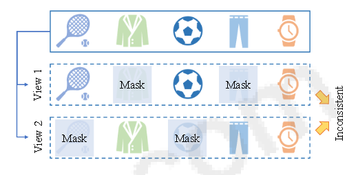

item之间存在关联性,如img1所示，第一个增强隐去了服装，保留了运动相关物品，相对应的运动T恤、运动裤之类同时兼具运动和服装相关的衣服就会被保留。

而第二个增强view中保留了衣服，隐藏了运动系列，同样会导致上一个问题，用户可能对运动系列产品（衣服）并不感兴趣，但是增强的数据中仍然包含了具有运动元素的服饰。

> 因此需要利用上下文信息生成更加有价值的正对


```Diffusion-based Contrastive Learning for Sequential Recommendation: 每次交互都与序列中的先前和后续 交互表现出很强的相关性。通过利用上下文信息， 我们可以捕获用户历史行为之间的顺序依赖性，从 而为识别原始序列中的单个项目的合适替代品提供实质性指导```


