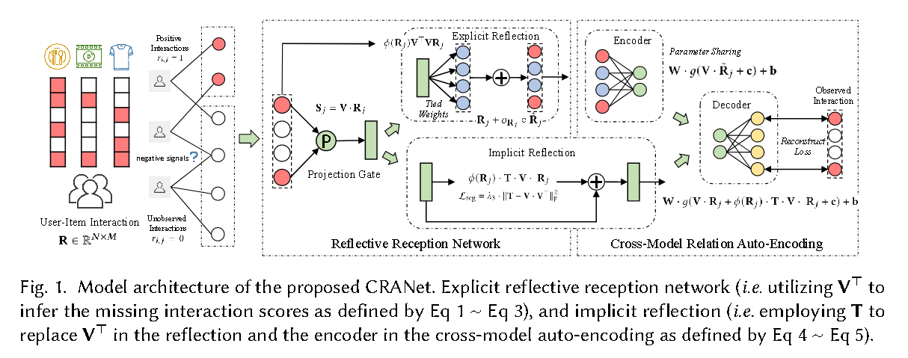
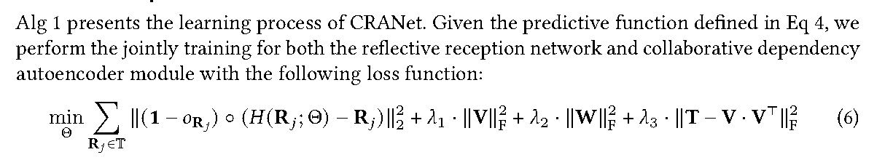
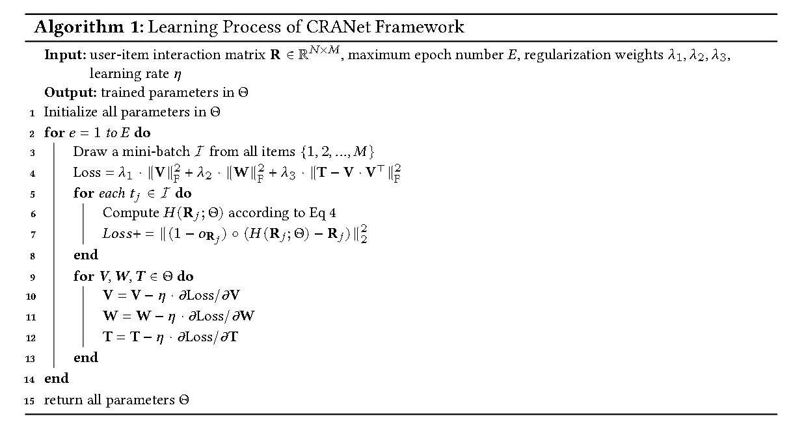

# [2022]CRANet

> Collaborative Reflection-Augmented Autoencoder Network for Recommender Systems(华南科技，港大)

代码：https://github.com/akaxlh/CRANet

### The Reflective Reception Network

项目首先介绍了自己的project gate，用来映射user-item的交互数据到latent learning space。定义Ri为用户序列，Rj为items序列。

然后projection gate被定义为：

$$
S_j = V * R_j \\
V \in R^{ d_p · N}
$$

其中V是一个可学习的转移矩阵，dp是hidden state dimensionality。 Sj就是user-item交互的隐层表示。

### Reflection Gate for Interaction Encoding

为了探索不同的用户-项目关系并减轻可变稀疏偏差，论文设计了reflection gate来**将学习到的潜在嵌入传播回原始数据空间**。

定义了一个延迟函数 phi，对于一个交互数据Rj，首先有：

$$
\phi(R_j) = \frac{\alpha}{
    ||R_j||_0
}
$$

其中alpha是控制衰减强度的超参数，∥R𝑗 ∥0 represents the number of observed interactions

因此反射门可以被定义为：

$$
\hat{R_j} = \phi(R_j)·V^T·S_j = \phi(R_j)·V^T·V·R_j
$$

其中 V^T 是projection weight matrix，最终结果包含推断的定量偏好，然后合并推断的得分：

$$
\widehat{R_j} = h1(R_h;\{V\}) = R_j + o_{R_j} \circ \hat{R_j}
$$

其中 oRj 是zero indicator vector，被观察到的交互会被设置为0？，然后circle是element-wise product operation操作。

需要注意的是，学习到的得分越高说明用户越有可能和item产生交互。

这样我们最终得到的Rj，不仅保留了原始观察到的user-item交互，也编码了用户和非交互items之间的关系。并且通过反射机制和衰减因子的配合，CRANet通过生成具有均匀分布而不考虑可变稀疏度的数据，缓解了不平衡问题。

### Tied-Weight Scheme for Training Efficiency

CRANet通过tie-weight机制来合并projection和reflection gate的结果

With the dedicated parameter sharing schema, the incorporated parameter learning constrain could effectively address the variable sparsity issue

其实就是那个V^T (可学习转移矩阵V的转置！)消融实验里尝试用其他可学习矩阵U来替换它。

### Collaborative Dependency Auto-Encoding

为了捕获不同类型交互之间的关系，设计了一个信息融合自编码器，首先定义了一个encoder来映射交互矩阵Rj到一个低维隐空间。

decoder结构用来从编码之后的Rj里面重建Rj，最后输出层的shape和输入一样。

**The interaction relation fusion network is trained by minimizing the reconstruction loss between the original input and the corresponding reconstructed interactions， and jointly optimized with the reflective reception network**
  

首先定义了一个三层的自编码器结构：

$$
h_2(\widehat{R_j}; \{W, V,c,b\}) = W·g(V·\widehat{R_j} + c) + b
$$

其中W,V都是可学习的转移矩阵，c，b是偏置向量，g是sigmoid函数。**为了减少参数，并且增加准确性，这里的V和门控里面的是同一个！**

之后，**Parametric Regularized Reflection Process**，为了处理数据不平衡偏差之类，搞了一个新的可学习参数T用来替换 V*V^T

$$
H(R_j;\theta) = W·g(V·R_j+\phi(R_j)·T·V·R_j+c)+b
$$

然后通过一下损失优化：

$$
L_{reg} = \lambda_3·||T-V·V^T||^2_F
$$

