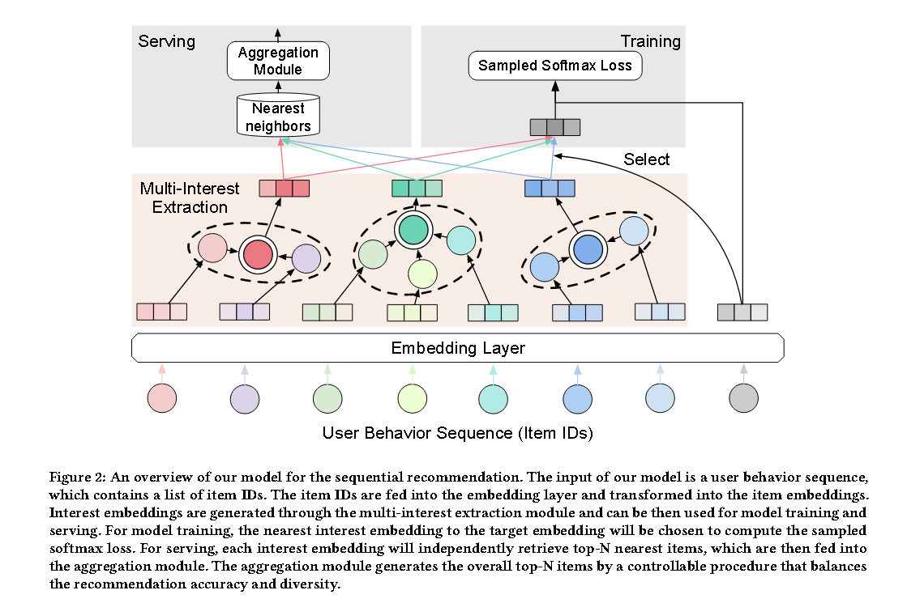

# [2020] ComiRec

> Controllable Multi-Interest Framework for Recommendation(清华，阿里)

ComiRec提出了一种新颖的可控多兴趣序列推荐框架，多兴趣模块从用户行为序列中捕获多种兴趣，可用于从大规模项目池中检索候选项目，然后把这些items输入到聚合模块以获得最终结果。

上图表示了当时（2020）年序列推荐中的一些问题，即统一的用户嵌入可能代表多种兴趣，如上图中的女孩对珠宝、手袋、化妆品都感兴趣，因此最后在用户记录中这三个类别都会出现。

而ComiRec的多级兴趣模块可以捕获用户的多种兴趣，用于检索候选items，上图最后就是ComiRec的示例。

文章提出，matching stage的关键因素就是从历史记录中生成高质量的用户表示（user embeddings）。

文章主要探索了两种构建多兴趣模块的方法：动态路由 和 自注意机制。其中使用动态路由的模型叫做ComiRec-DR，使用SA的叫做ComiRec-SA。

## Dynamic Routing

用户序列中的item embeddings可以被视为是一个主要胶囊，并且多个用户兴趣可以被视为兴趣胶囊。论文使用CapsNet中的动态路由进行兴趣抽取。

胶囊是一组神经元，其活动向量表示特定类型的实体的实例化参数。胶囊的输出向量长度表示胶囊所表示的实体在当前输入中的概率。

在动态路由中首先计初始层的胶囊i为ei，然后根据ei计算下一层的胶囊j：

$$
\hat{e_{j|i}} = W_{ij}e_i
$$

其中 Wij 是变换矩阵，胶囊j的总输入是所有预测向量 ej 的加权和：

$$
s_j = \sum_{i} c_{ij}
$$

其中 cij 是迭代动态路由过程中确定的耦合系统。胶囊i与下一层中所有胶囊之间的耦合系统应该为1。论文使用“routing softmax”计算耦合系统：

$$
c_{ij} = \frac{
    exp(b_{ij})
}{
    \sum_{k} exp(b_{ik})
}
$$

其中 bij 表示胶囊i应该耦合到胶囊j的对数先验概率。文章提出了一种非线性“挤压”函数来确保短向量收缩到几乎为零的长度，长向量收缩到略低于1的长度，胶囊j的向量计算公式如下：

$$
v_j = squash(s_j) = \frac{
    ||s_j||^2
}{
    1 + ||s_j||^2
} \frac{s_j}{||s_j||}
$$

其中 sj 是胶囊j的总输入， vj是输出胶囊。我们最后获得所有胶囊组成兴趣胶囊矩阵：

$$
V_u = [v_1, v_2, ..., v_K]
$$

然后把兴趣矩阵 Vu 用于下游任务。

## SA

为了表示用户的整体兴趣，需要关注来自不同兴趣的用户行为的多个vu，所以需要多次注意力，将SA中的注意力向量a拓展成注意力矩阵A：

$$
A = softmax(W^T_2 tanh(W_1H))^T
$$

最终的输出Vu为：

$$
V_u = HA
$$

## Model Training

使用 argmax 算子为目标项目 i 选择对应的 user embedding vector：

$$
v_u = V_u[:, argmax(V^T_u e_i)]
$$

$$
P_{\theta}(i|u) = \frac{
    exp(v^T_u e_i)
}{
    \sum_{k \in I} exp(v^T_u e_k)
}
$$

上述公式计算用户u交互item i的概率。而模型的目标就是最小化以下负对数似然：

$$
loss = \sum_{u \in U} \sum_{i \in I_u} -logP_{\theta}(i|u)
$$

## Aggregation Module

在多兴趣提取模块之后，论文根据每个用户过去的行为获取多个兴趣嵌入。

一般情况下检索前N个项目，基本方法就是直接根据item的inner production proximity和用户兴趣相似度来合并或者过滤项目：

$$
f(u, i) = \max_{1<=k<=K}(e^T_i v^{(k)}_u)
$$

其中 v_k_u 表示user u的第 k 个兴趣embedding，这种聚合过程可以最大化推荐准确性。

但是，人们可能会被推荐新的或者多样化的东西，如一个包含从用户 u 的 K 个兴趣中检索到 K·N 个项目的集合 M， 找到一个包含 N 个项目的集合 S，使得预定义的价值函数最大化。

$$
Q(u, S) = \sum_{i \in S}f(u, i) + \lambda \sum_{i \in S} \sum_{j \in S}g(i, j)
$$

