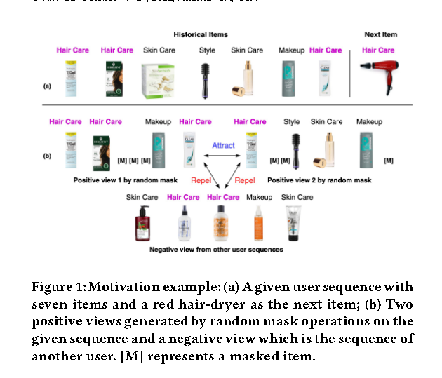
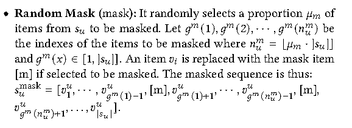
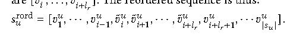
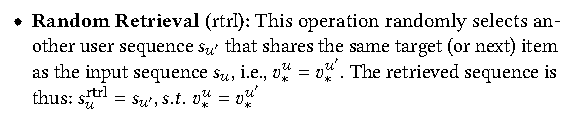
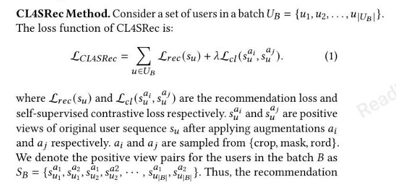
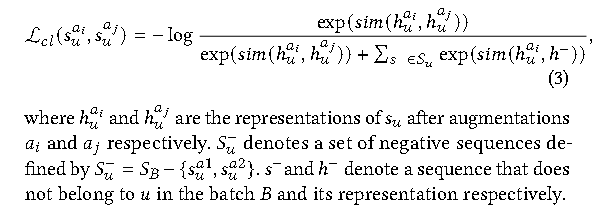
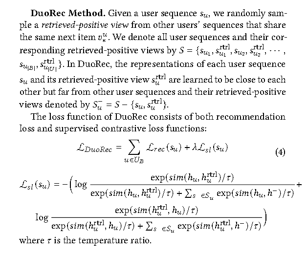
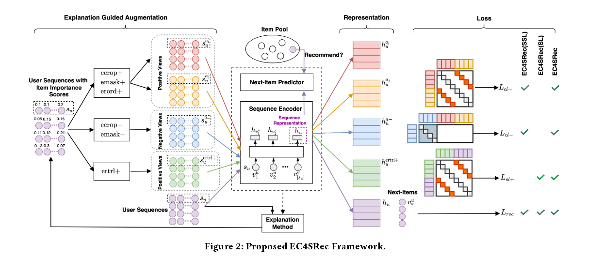
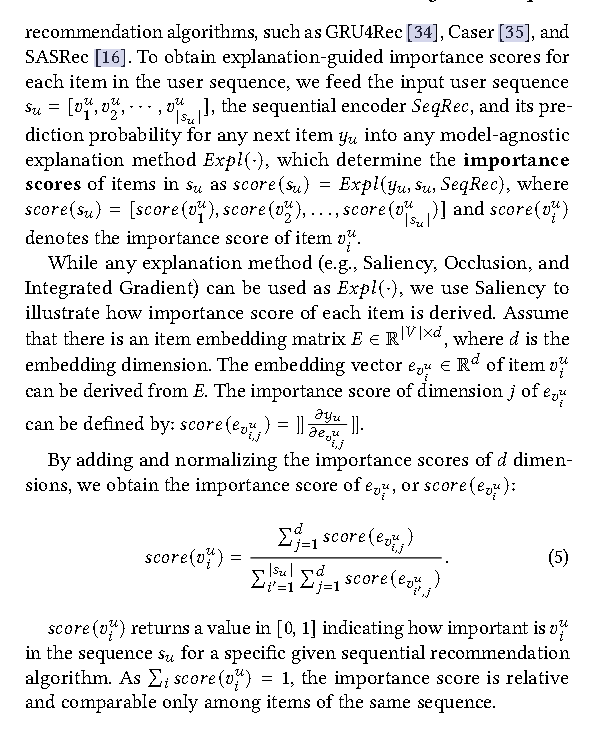

# [2022] EC4SRec

> Explanation Guided Contrastive Learning for Sequential Recommendation(新加披管理大学？ Singapore Management University)
> 研究生导师，含金量有待参考

代码：https://github.com/demoleiwang/EC4SRec （基于RecBole）

Explanation Guided Augmentations (EGA) and Explanation Guided Contrastive Learning for Sequential Recommendation (EC4SRec) model framework.

即为通过 EGA -> augment EC4SRec

for acc result -> learn a high-quality user representation from user's historical seq which match the user representation against candidate items.

如上图中（a）序列中有当前用户的7个交互items，下一个交互是红色的吹风机；（b）是给定序列通过随机掩码生成的两个正视图和另一个user的负视图

意思是（a）中用户明显对Hair Care感兴趣，但是（b）的mask掉了两个Hair Care，所以这样的augment是不合理的，会丢失信息

> 提出解释引导扩充 (EGA) 以使用解释方法推断给定用户序列的重要项目，并在扩充操作中考虑项目重要性。这样，可以为对比学习得出更好的正面观点和负面观点
> 
> 我们还提出了顺序推荐的解释引导对比学习(EC4SRec) 框架，以利用积极和消极的观点进行用户序列表示的自我监督和监督学习。

## 主要创新
1. 提出了一个解释性方法用来mask，用EGA来控制正负样本的生成。
2. 把CL4SRec和DuoRec合起来提出了一个框架叫EC4SRec（额外的负面视图采样用于对比学习，以更有效地将正面视图的表示与负面视图的表示分开）
3. 我们提出了几种解释引导的增强操作，以使用从解释方法得出的重要性分数生成正用户序列和负用户序列。通过这些操作，EC4SRec可以在对比学习中有效地利用增强的正负用户序列来获得更好的推荐序列表示

### 摘要

EGA used to consider item importance in  augmentation operations.

first utilize explanation methods to improve seq Rec.

***from explanation methods to generate "importance score derived from explanation methods" 利用 augment positive / negative user representations to get better seq representation fro Rec.***

【通过解释引导增强 / 解释引导对比学习】

## 问题定义

$$
S_u = [V^u_1, V^u_2, ... , V^u_{|S_u|}]
$$

Su表示当前用户u的交互序列, S^u_i 表示当前用户u和item i 产生了交互.

后面介绍了常用的四种mask方式，分别来自于CL4SRec和DuoRec

### Crop

在seq中**随机移除remove**了一段连续的，长度为 l 的subseq，假设索引从i开始，即为：

$$
subseq = [V^u_i, V^u_{i+1}, ... , V^u_{i + l}]
$$

### Mask

### Rord

和Crop一样先随机选择一段连续的长度为 l 的subseq，然后shuffle随机打算，再放回去。

### Rtrl

## 损失函数

### CL4SRec

这一段中的Sb的含义为，每一个epoch中采样的batch中有 |B| 个数量的user交互，每个交互从 {crop， mask， rord}里面生成两个正样本对 ai 和 aj， 这样Sb中就有 2|B| 个数量的交互样本（两两对应，都是正样本对）

然后结合负样本做一个loss

<u>**这里有一个有意思的地方：负样本对只对齐了 ai，为什么只对齐 ai， aj被舍弃了吗？这里是否可以考虑修改?**</u>

### DuoRec

## 框架

EC4SRec由一个序列编码器组成，用于将给定用户的历史项目序列 Su 表示为向量,表示通过返回下一个推荐项目的下一个项目预测器与公共池中的项目进行匹配。

与现有的顺序推荐对比学习方法（例如 CL4SRec、DuoRec）不同，EC4SRec 在预定的时期利用解释方法来确定用户序列，其中下一项由序列编码器和下一项预测器返回每个 Su 的 items 项的重要性。

接下来，解释引导增强将利用项目重要性分数生成用户序列的正面和负面视图，以进一步训练序列编码器和下一个项目预测器。

### 解释引导增强

论文提出了5中augment手段，其中3个用于正样本，2个用于负样本，实验表明负样本观点也可以显著提高模型的准确性。

#### Explanation Guided Crop for Positive and Negative View

#### Explanation Guided Mask for Positive or Negative View

#### Explanation Guided Reorder for Positive View (erord+)

#### Explanation Guided Retrieval for Positive View (ertrl+)

### Explanation Guided Contrastive Learning

## 实验