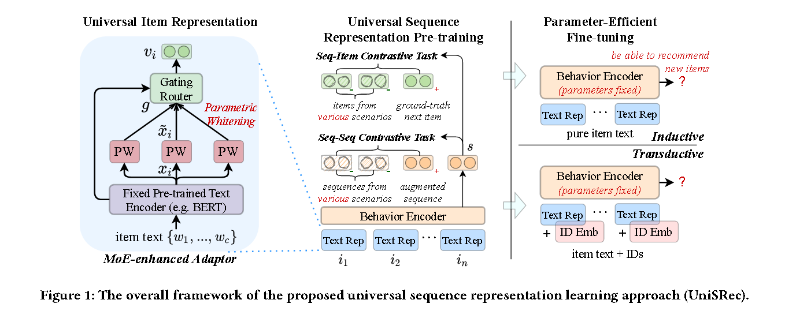
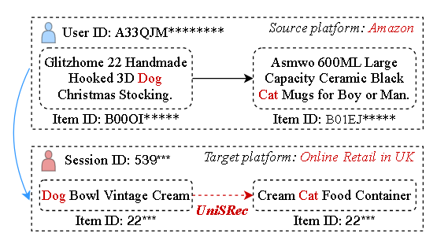

# [2022]UniSRec

> Towards Universal Sequence Representation Learning for Recommender Systems(人大-高岭人工智能学院)

代码：https://github.com/RUCAIBox/UniSRec



UniSRec使用ItemID和文本替代itemID

## Universal Item Representation

1. 通过BERT对item的文本进行编码

```
xi = BERT([CLS]; w1, w2, ..., wc)
```

2. 通过参数白化进行语义转移 *Semantic Transformation via Parametric Whitening*

原因：Existing studies have found that BERT induces a non-smooth anisotropic semantic space for general texts.The case will become more severe when we mix item texts from multiple domains with a large semantic gap.

**参数白化**
$$
\widetilde{x_i} = (x_i - b) * W_1
$$

3. 通过MoE适配器进行域融合与增强

意思是通过第二步BERT分割出来的词在不同领域中会有很大的不同，如：*For example,the top frequent words of item text are quite different across domains, e.g., natural, sweet, fresh for food domain and war, love, story for movies domain*, 所以需要一种合理的机制来捕获域信息。

$$
v_i = \sum_{i}^{G}(g_k * \widetilde{x_i}^{(k)})
$$


来自门控路由器的相应组合权重
$$
g = Softmax(x_i*W_2 + \delta)
$$

$$
\delta = Norm() * Softplus(x_i * W_3)
$$

## Universal Sequence Representation Pre-training

### *Sequence-item contrastive task.*

首先编码embedding
$$\{<s_1, v_1>, ..., <s_B,v_B>\}$$

其中s表示 normalized contextual sequence representations

v表示 the representation of the positive next item

sequence-item loss formulation：
$$
l_{S-I} = - \sum_{j=1}^{B}{\log{
    \frac{
        \exp{(s_j*v_j/\tau)}
        }
        {
            \sum_{j'=1}^{B}{\exp{(s_j*v_{j'}/\tau)}}
        }
    }}
$$

### *Sequence-sequence contrastive task*

The object is to discriminate the representations of augmented sequences from multi-domain sequences.


1. ***Item drop*** refers to randomly dropping a fixed ratio of items in the original sequence
2. ***Word drop*** refers to randomly dropping words in item text

sequence-sequence contrastive loss formulation:
$$
l_{S-S} = - \sum_{j=1}^{B}{
    \log{\frac{
        \exp{(s_j*\widetilde{{s_j}}/\tau)}
    }{
        \sum_{j'=1}^{B}{
            \exp{(s_j*s_{j'}/\tau)}
        }
    }}
}
$$

### *Multi-task learning*

$$
L_{PT} = l_{S-I} + \lambda*l_{S-S}
$$


## Case study

It shows that our approach can capture universal sequential patterns across platforms in terms of general textual semantics.

