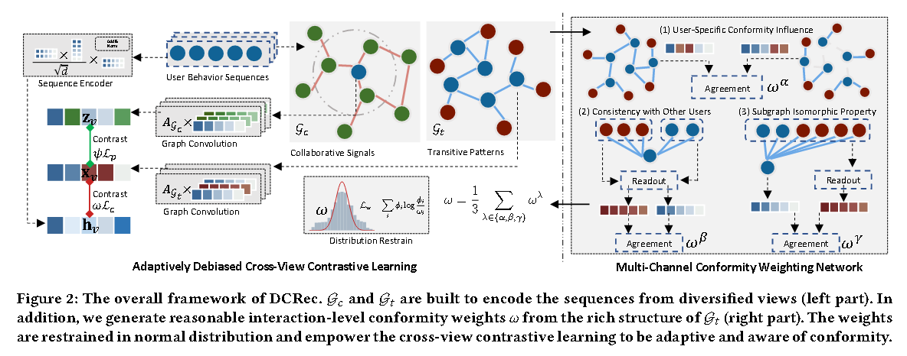

# [2023] DCRec

> Debiased Contrastive Learning for Sequential Recommendation(港大、微信)

代码：https://github.com/HKUDS/DCRec（基于RecBole）

DCRec 将对比学习与一致性和兴趣解开相结合，以学习意识到流行偏见的增强表示。

论文的主要贡献是：
1. 强调了通过以适应性强的方式提取自监督信号来解决稀疏和嘈杂的用户序列数据中流行度偏差问题的重要性，这种方式可以解开用户的一致性和推荐的实际兴趣。
2. DCRec解决了通过多通道一致性加权网络计算用户序列数据中的流行度偏差。

论文的编码还是用Transformer，先把emb+position emb合并为hv：

$$
h^0_v = v_v + p_v
$$

然后把送到SA里面。

需要生成两个图，item转换图 Gt 和  交互图 Gc，并且两个图都是在items集合V上构造的：

