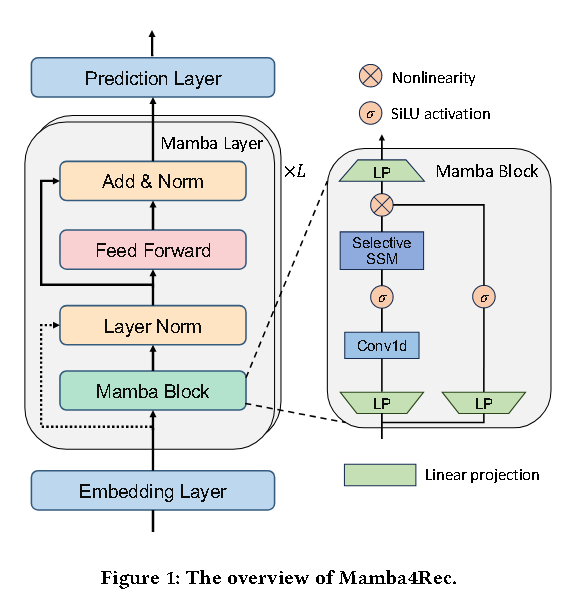
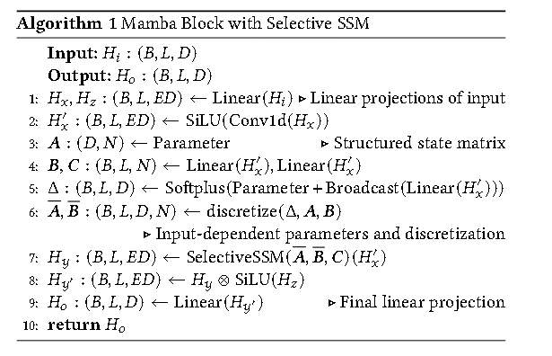

# [2024] Mamba4Rec

> Mamba4Rec: Towards Efficient Sequential Recommendation with Selective State Space Models(Texas A&M University,上交)

代码：https://github.com/chengkai-liu/Mamba4Rec （基于RecBole）

代码：https://github.com/AlwaysFHao/Mamba4RecWithoutRecbole （Mamba4Rec复现-无需Recbole环境）

使用Transformer作为骨干网络的框架，利用SA机制来建模动态用户行为序列，但是这些基于注意力的方法通常受到注意力算子固有的二次计算复杂性而导致推理效率低下的问题。

特别是对于长用户行为序列或大规模数据集，性能和效率之间的这种权衡阻碍了它们的实际应用。

状态空间模型SSM在NLP任务中大放异彩，SSM变体**Mamba进一步引入了输入依赖的选择机制和高效的硬件感知设计，以解决先前 SSM 的数据无关问题**。

这样模型可以根据输入数据选择性地提取必要的知识并过滤掉不必要的噪声，从而卓越的顺序建模能力。

## SSM

SSM基于线性常微分方程的序列建模，将输入序列 x 通过隐空间latent state h(x) 映射到输出序列 y

$$
h^{\prime}(t) = Ah(t) + Bx(t) \\
y(t) = Ch(t)
$$

其中A， B， C都是可学习矩阵，但是要对离散序列进行建模，还需要先按照步长对seq进行离散化：

$$
h_t = \bar{A}h_{t-1} + \bar{B}x_t \\
y_t = Ch_t \\
\bar{A} = exp(\triangle A), \bar{B} = (\triangle A)^{-1}(exp(\triangle A) - I)(\triangle B)
$$

将参数从连续形式转换为离散形势后，model就可以以线性递归方式进行计算。

## Overview

### Position Embedding

在SASRec和BERT4Rec中，通常将item位置embedding add到input embedding上然后再把处理后的数据从到LayerNorm层。

然而，SSM和Transformer不同，本质上是通过循环来处理顺序信息，虽然理论上没有必要，但是在实验中paper分析了position embedding嵌入对模型的影响。

### Mamba Layer

Mamba Block 利用依赖于输入的适应和选择性 SSM 来有效地处理顺序信息，其实就是取代了一个 Transformer Block，本质上是一个SA模块。

论文同样提出了一个**Position-wise Feed-Forward Network（PFFN）**用来提高user actions在hidden dimension中的效果：

$$
PFFN(H) = GELU(HW^{(1)} + b^{(1)})W^{(2)} + b^{(2)}
$$

PFFN 旨在通过使用带有激活函数的密集层应用两个非线性变换来捕获序列数据中的复杂模式和交互。然后在每个Mamba Block之后添加了dropout和LayerNorm帮助收敛。

## 消融实验

**Positional embedding**：结果表明，由于Mamba Block的循环性质，添加可学习的位置嵌入不会提高性能

**Feed-forward network**：结果表明，PFFN layer对于较长序列数据特别有效

**Mamba block only**:只使用一个Mamba Block会加速计算，但是会降低性能

**Number of Mamba layers**：堆两个最好

