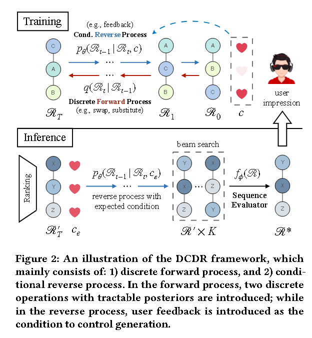
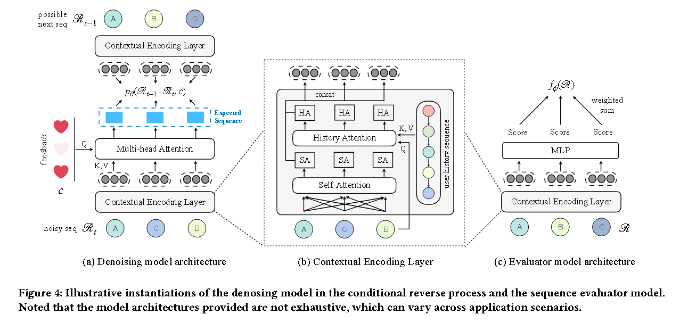

# [2023] DCDR

> Discrete Conditional Diffusion for Reranking in Recommendation(快手)

本文探讨了扩散融合模型在重排序中生成高质量序列的潜力.

DCDR 通 过引入具有易处理后验的离散前向过程来扩展传统的扩散模型，该过程通过逐步离散操作（例如交换）向项目序列添加噪声。此外，DCDR 还包含一个条件逆向过程，可根据预期的用户响应生成项目序列。

DCDR通过离散前向过程和用于序列生成的条件反向过程扩展了传统扩散模型.

在前向过程的每一步中， DCDR 使用离散运算向输入序列添加噪声。我们提出了两种离散操作，包括排列级操作和令牌级操作。相反的过程中,DCDR将用户反馈引入到去噪模型中作为生成条件。

最近，一些研究尝试将扩散模型应用于顺序推荐，其重点是根据用户的历史交互生成下一个项目。但是，值得注意的是，本文讨论的重新排序任务与典型的顺序推荐不同。具体来说，重排序旨在生成可行的项目排列， 而不是关注下一个项目嵌入或用户向量，这对重排序阶段的扩散模型的应用提出了重大挑战。

## DISCRETE CONDITIONAL DIFFUSION RERANKING FRAMEWORK

