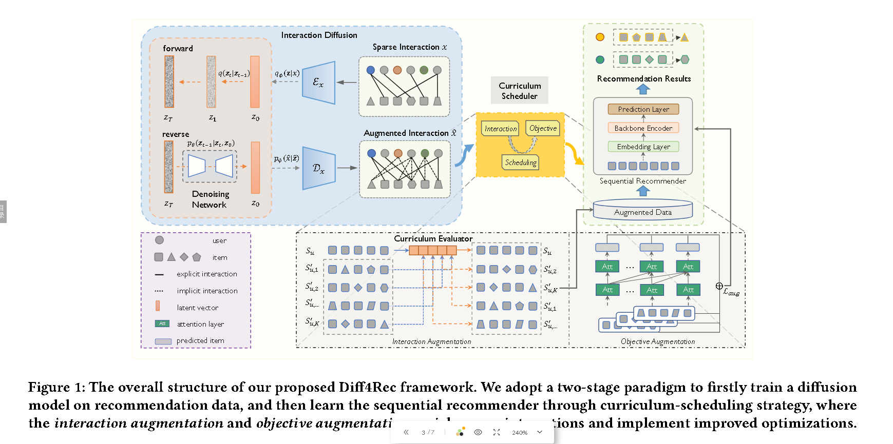

# [2023] Diff4Rec

> Diff4Rec: Sequential Recommendation with Curriculum-scheduled Diffusion Augmentation(清华)

<u>***不开源，是不是也是因为不敢？***</u>

本文主要用Diff做数据增强，类似于PDRec。

论文提出了两种增强：**交互增强**和**客观增强**，其中交互增强指的是**利用生成的样本来 丰富历史序列并揭示多样化和未发现的用户意图**，而客观增强是**利用生成的样本来服务作为增强训练 目标的候选项目，从而产生更好的参数优化和模型 性能**。

## Diff4Rec

Diff4Rec整体步骤为，首先利用潜在扩散模型以去噪方式预测 user-item 的交互，然后预训练的扩散模型生成的预测，通过增强交互序列的方式来增强样本的多样性，然后把样本用于下游序列推荐器中获得结果。

这个论文的思想其实和PDRec差不多，都是使用一个预训练的Diff做data augment，之后把增强后的数据用在下游的SAS或者GRU、BERT4Rec等模型进行预测。

