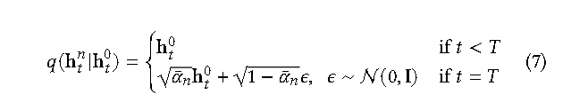
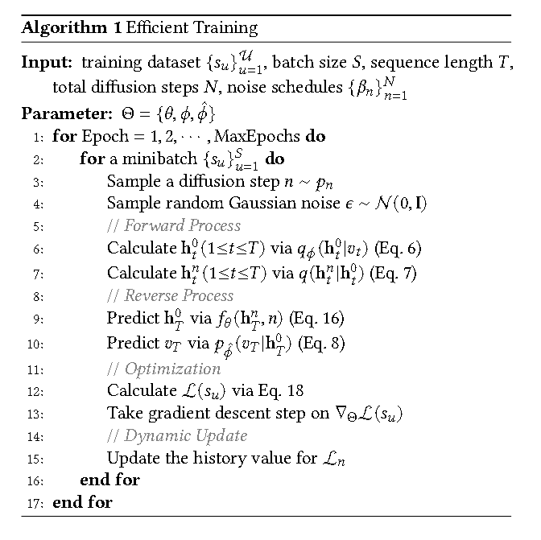
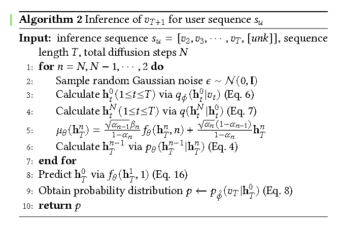

# [2023]DiffRec

> Sequential Recommendation with Diffusion Models(苏大)
>
> 2023年提出了两个DiffRec，一篇是新加披国立，一篇是苏大的

***不敢开源！！！***

现有的生成模型仍然存在后验崩溃问题或模型崩溃问题，从而限制了它们在顺序推荐中的应用。本文提出的DiffRec可以避免基于 VAE 和 GAN 的模型的问题，具有更好的性能。

论文在前向过程中设计了一个额外的transition，在反向过程中也涉及了一个transition以实现对离散推荐数据的处理。

论文还设计了一种不同的噪声策略，**仅对目标项而不是整个序列进行噪声处理**。

生成模型假设真实数据遵循未知的概率分布，并尝试使用神经网络来近似该分布。

受非平衡热力学的启发，扩散模型使用预定义的马尔可夫链逐渐将原始数据转换为高斯噪声，这称为前向过程。

然后训练神经网络在多个扩散步骤中反转噪声，从而从噪声数据中重建原始数据，这称为逆过程。

由于前向过程遵循预定义的马尔可夫链，没有任何可学习的参数，因此很容易控制生成的隐藏表示的质量并避免后验崩溃问题。扩散模型仅训练单个神经网络作为数据降噪器，这更容易优化，并且不易受到模型崩溃问题的影响。

## Forward Process

为了适配序列推荐，首先定义了一个额外的转换，用于把 vt 转换为 ht（把离散的item映射到hidden representation ht）

模型的diffusion process中并非对整个序列加噪，而是只对隐层表示中的target item进行加噪。

最后，在reverse process中，定义了另一个转换用于把hidden表示转换回items概率。

下步公式是 adapt diffusion models的步骤，是把离散的 vt 转换为hidden表示的 ht 的操作。

$$
q_{\phi}(h^0_t | v_t) = N(E(v_t), \beta_0I), E(v_t) = vt 
$$

diffusion process中不对整个序列加噪是因为可能回损坏重要信息，所以只对target item加噪。

因此论文重新定义了加噪时刻的公式：

## Reverse Process

反向中额外添加的步骤就是多一个变换，把 ht_0 转换为 vt （把hidden表示转换回概率分布）

$$
p_{\hat{\phi}}(v_t | h^0_t) = softmax(W h^0_t + b)
$$

这个变换把连续的hidden表示重新映射回离散的items，通过计算最后一个时刻T的p，我们就可以得到每一个item被推荐的概率。

## Denoise Sequential Recommender

论文需要一个神经网络 f_phi 去进行预测，论文这个神经网络叫做 DSR， DSR基于整个序列 H 的隐藏表示 去输出 去噪后的隐藏表示。

DSR outputs the denoised hidden representation 𝑓𝜃 (h𝑛 𝑇 , 𝑛) based on the hidden representation of the whole sequence H𝑛。

由于DSR需要处理不同 diffusion-level的隐藏表示，所以构造了一个基于 diffusion-step 的嵌入矩阵来表示所有的隐藏表示。

然后论文把 序列表示H， 位置embedding， diffusion-step embedding相加，的带了最终的H：

$$
\hat{H^n} = [h_1^n + y_1 + z_n, h^n_2+y_2+z_n,...,h^n_t+y_t+z_n, ..., h^n_T+y_T+z_n]
$$

其中 yt 是可学习position embedding vector for timestamp t。 diffusion-step embedding z_n 可以通过以下正弦函数获得：

$$
z_n(2j) = sin(n/10000^{2j/d}) \\
z_n(2j+1) = cos(n/10000^{2j/d}), 0<=j<d/2
$$

最后使用Transformer Encoder来处理H并获得了最后一个时间步的隐藏表示：

$$
f_{\phi}(h^n_T, n) = TransformerEncoder(\hat{H^n})[-1]
$$

## 推理

和之前一样，在序列的最后加上一个token，但是受限于seq的最长长度，我们会把第一个item drop掉，这样实际用来预测推理的seq就是：

$$
[v_2, v_3, v_4, ..., v_T, [token]]
$$

然后我们通过最后一个时刻T的隐层表示来预测token。

下述代码为训练阶段：

下述代码是推理阶段：

## 实验

实验认为模型的效果来自于：
1. DiffRec将项目表示视为概率分布，并且需要从随机高斯噪声中采样，这可以模拟现实世界中用户行为的不确定性
2. DiffRec不使用神经网络来估计均值和方差，而是采用预定义的马尔可夫链来控制前向过程，可以生成信息损失较少的高质量样本。对目标项目而不是整个序列进行噪声处理也有助于保留有关用户偏好的基本信息
3. 推理策略增加了推荐结果的多样性，进一步提高了性能.
