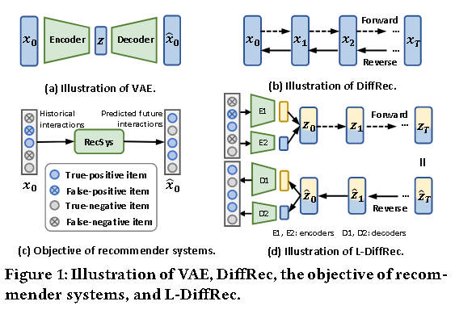
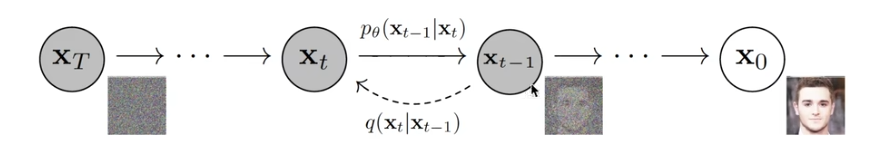
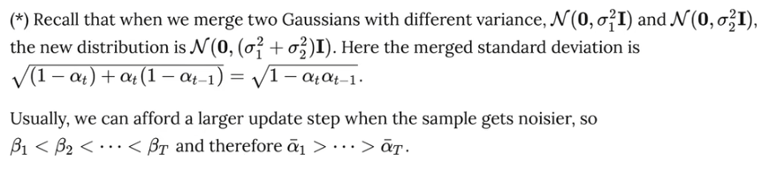
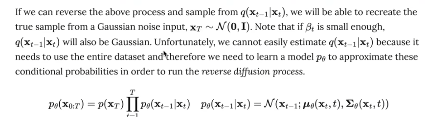
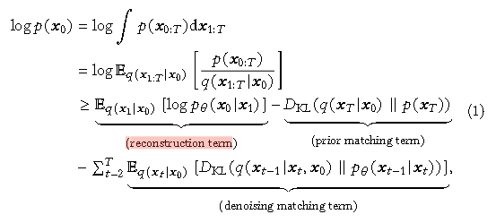
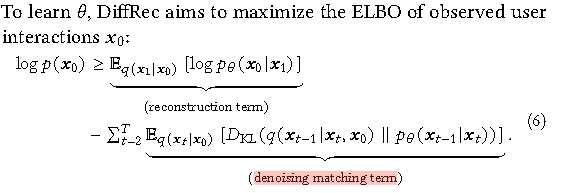
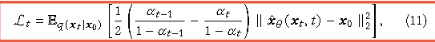
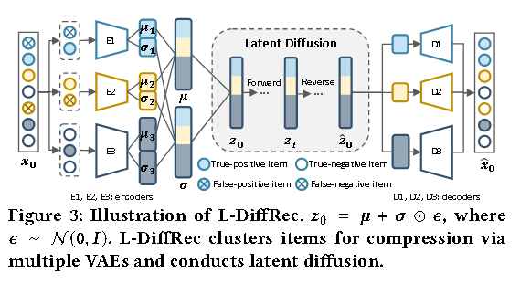

# [2023]DiffRec

> Diffusion Recommender Model(新加坡国立)
>
> 第一篇将diffusion用于推荐的论文


Diff-Rec提出了两个变体：
1. ：L-DiffRec 对item进行聚类以进行维度压缩，并在潜在空间中进行扩散过程 
2. T-DiffRec 根据交互时间戳重新加权用户交互以编码时间信息

## Generative recommender

生成推荐模型主要分为两类：

### GAN-based models

utilize a generator to estimate users' interaction probabilities and leverage adversarial training to optimize the parameters 

对抗性训练通常不稳定，导致性能不理想

### VAEs-based models

use an encoder to approximate the posterior distribution over latent factors and maximize the likelihood of observed interactions

但 VAE 却面临着易处理性和表示能力之间的权衡问题。易于处理且简单的编码器可能无法很好地捕获异质用户偏好，而复杂模型的后验分布可能很棘手





DiffRec 通过在前向过程中注入预定的高斯噪声来逐渐破坏用户的交互历史，然后通过参数化神经网络迭代地从损坏的交互中恢复原始交互。

L-DiffRec 将项目聚类成组，通过组特定的VAE将每个组上的交互向量压缩为低维潜在向量，并在潜在空间中进行正向和反向扩散过程。L-DiffRec显着减少了模型参数和内存成本，增强了大规模项目预测的能力。

T-DiffRec 通过简单而有效的时间感知重新加权策略对交互序列进行建模。直观上，用户后来的交互被分配更大的权重，然后输入 DiffRec 进行训练和推理。


## 插入Diffusion



前序扩散和反向生成。

### 正向过程

给定初始数据分布的 ```x0 ~ q(x)```, 可以不断地向分布中添加高斯噪声，该噪声的标准差是以固定值 βt 而确定的， 均值是以固定值 βt 和当前 t 时刻的数据 xt 确定的。**整个过程是一个马尔科夫链**。

随着t的不断变大，最终数据分布 xT 变成了一个各向独立的高斯分布。


$$
q(X_t | X_{t-1}) = N(
    X_t;
    \sqrt{1-\beta_{t}} X_{t-1},
    \beta_{t}I
)
$$

$$
q(X_{1:T} | X_0) = \prod_{t=1}^T{q(
    X_t | X_{t-1}
)}
$$

但是任意时刻的 q(xt) 推导也可以完全基于 x0 和 βt 计算出来，而不需要进行迭代计算。

前向传播中 t 时刻的 xt, z为高斯噪声，公式为：

$$
X_t = \sqrt{\alpha_t} X_{t-1} + \sqrt{1-\alpha_t} Z_{t-1} \\
= \sqrt{\widehat{\alpha_t}} X_0 + \sqrt{1-\widehat{\alpha_t}}Z \\


let \alpha_t = 1-\beta_t \quad and \quad \widehat{\alpha_t} = \prod_{i=1}^T{\alpha_i}

\\
q(X_t | X_0) = N(X_t;
\sqrt{\widehat{\alpha_t}}X_0,(1-\widehat{\alpha_t})I)
$$




## 重建过程 逆过程

逆过程是从高斯噪声中恢复原本的数据，可以假设他也是一个高斯分布，但是无法逐步拟合分布，所以需要构建一个参数分布去做估计。**逆过程仍然是一个马尔科夫链**。




## 回到DiffRec

### Traning ... loss

DiffRec基本沿用Duffusion结构



在一个标准的DiffRec结构中完整的损失函数如上，但是在实际的训练中prior matching term被省略。



DiffRec被用于个性化推荐，将用户交互矩阵送进去进行加噪和扩散生成，在论文中需要构造两个损失函数，其一为reconstruction term，其二为denoising matching term

其中第二个损失主要用于从 t 时刻去噪生成 t-1 时刻的数据。最后整合的数据如下:




如上述公式中，X_seta 是模型预测出来的结果，表示 t 时刻的值， 和 x_0 进行了MSE，前置项是一个SNR。

在论文中的说法是使用和Multi-VAE相同的策略使用MLP预测 x_seta(x_t, t) （其实就是x_0）,然后和实际的x_0进行MSE

```python
# 优化出一个x_0和noise
model_output = model(x_t, ts)

# 记录x_0和noise
target = {
    ModelMeanType.START_X: x_start,
    ModelMeanType.EPSILON: noise,
}[self.mean_type]

assert model_output.shape == target.shape == x_start.shape

# 均方误差
mse = mean_flat((target - model_output) ** 2)
```

之后单独计算SNR（即t-1时刻的alpha和t时刻的1-alpha的比值），最后相乘得到L_t

```python
weight = self.SNR(ts - 1) - self.SNR(ts)
# weight值，将t时刻为0的值修改为1.0
weight = th.where((ts == 0), 1.0, weight)
loss = mse

# L_t损失
terms["loss"] = weight * loss
```

之后还需要计算reconstruction term，原则上总损失应该为：

$$
L_1 = -E_{q(x_1|x_0}{[\log{p_{\theta}(x_0|x_1)}]}
$$

总损失为

$$
L = -L1 - \sum^{T}_{t=2}L_t
$$

但是形式上，reconstruction term等同于计算denoising matching term的第一步，不同是缺少了权重（SNR部分，因为此时没有 t-1 时刻），因此可以通过最小化

$$
\sum^T_{t=1}L_t
$$

来优化模型的参数，所以在实际实现中，作者通过均匀采样步骤 t 来优化期望 L(x_0, theta)

$$
L(X_0, \theta) = E_{t - u(1, T)}L_t
$$

> 与传统的Diffusion优先区别的是：传统diffusion训练的是noise，也就是预测噪声（epsilon），而DiffRec中预测的是x_0，也就是喂进去的交互图。
> 1. 预测的目标是预测item rank，所以 x_0-ELBO 更加符合直觉(符合任务需要)
> 2. 随机采样 epsilon ~ N(0,1) 是不稳定的，会增加训练MLP的风险


### L-Diffusion

Diffusion的变体，因为Multi-VAE和DiffRec等生成模型在预测的时候需要同时生成所有items的交互概率x_0，需要消耗大量的资源。所以L-Diffusion先通过VAE对items进行聚类以便压缩维度，并在latent space中进行扩散。



L-DiffRec先通过k-means将items聚类为C类别(基于lightGCN预训练物品的item嵌入表示)。其余基本没太大变化

### 详细参考

```https://blog.csdn.net/Blueghost19/article/details/130215990```