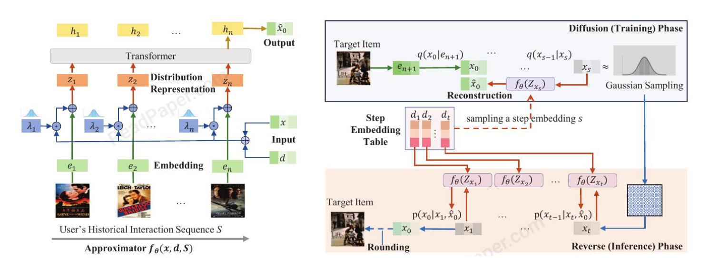

# [2023] DiffuRec

> DiffuRec: A Diffusion Model for Sequential Recommendation(武汉大学)

子注意力机制在捕获长期依赖性方面具有卓越的能力，SAS是一项开创性的工作，应用单项Transformer来学习序列中的item转换模式。GNN可以捕获item之间的高阶依赖.

首先提出LSTM、SA、GNN这些方法在以下方面的不足：

- Multiple Latent Aspects
- Multiple Interests
- Uncertainty
  - 由于用户兴趣的多样性和演变，用户当前的偏好和意图在一定程度上变得不确定。**Paper认为将用户当前的兴趣建模为分布更为合适。**
- Guidance of Target Item
  - 涉及目标项的交互可能会给网络设计带来巨大的计算成本和深度耦合

## Model



模型三个部分：

1. (逼近器)Approximator for target item representation reconstruction
2. （前向扩散）Diffusion process to incorporate the guidance of target item and inject noise for robust approximator learning
3. （反向去噪）Reverse(Inference) phase for target item prediction


## 前向传播

和普通的扩散模型没什么区别：

$$

x_0 -> x_1 -> ... -> x_T
$$


## 后向去噪

后向是一步步回来的，**没有使用DDIM加速**，所以DiffuRec的timesteps设置得很小

意思是，正常得DDPM中可以通过计算近似得KL散列，一步到位直接从t时刻获得估计的初始x，但是这里每一步都依赖一个x_0,所以paper训练一个Transformer用来根据Z生成x_0，然后把这个近似器Transformer的x_0用来反向去噪，然后在进行损失计算。


## 10.13补充


使用static item embedding ```ej``` 作为在latent space中的semantic encoding。

模型在diff过程中通过从history交互序列S中恢复target item，通过diff forward过程向target item embedding中添加noise。

diffusion过程中，noising之后的target item representation是xs，注入噪声可以帮助diffu获得多个潜在方面的表示，从而利用target item的指导作为辅助语义信号。生成的样本为Z，最后再通过近似器去噪获得预测出来的x0，让后计算损失，让x0和target item embedding接近。


模型使用Transformer作为近似器


主要是diffusion的反向和推理过程中，每一步都依赖x0，而这个x0就是我们在diffu过程中通过训练Transformer训练出来的，通过训练好的模型直接预测出x0，然后再反向过程中计算xt-1.


