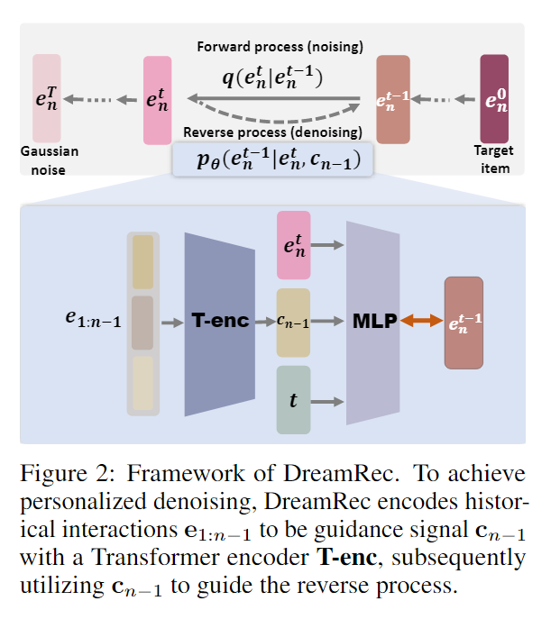
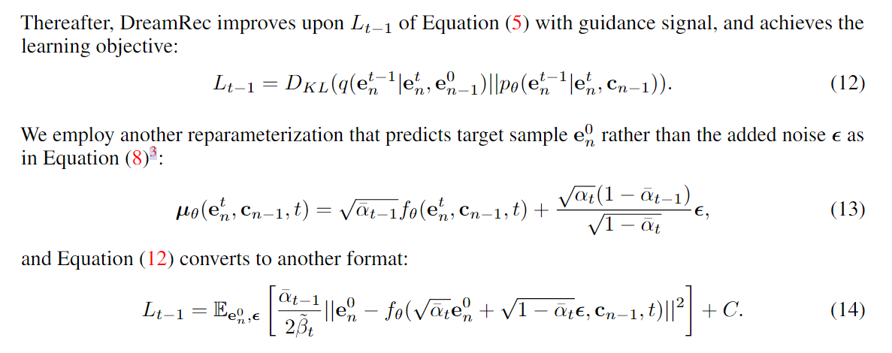

# [2023] DreamRec

> Generate What You Prefer: Reshaping Sequential Recommendation via Guided Diffusion(中科大)

代码：https://github.com/YangZhengyi98/DreamRec

推荐模型范式为：给定一个正项，推荐模型执行负采样以添加负项，并根据用户的历史交互序列学习对用户是否更喜欢它们进行分类。

但是上述范式，有两个局限：
1. it may differ from human behavior
2. the classification is limited in the candidate pool with noisy or easy supervision

DreamRec也用了一个Transformer架构来生成样本，去噪中生成了一个oracle item来恢复正样，从而砍掉负样本，直接描述用户的真实偏好。

具体来说，模型的步骤为，先定义 interaction sequence：
$$
e_{1:n-1} = [e_1, e_2, ..., e_{n-1}]
$$

然后通过Transformer对emb进行编码：

$$
c_{n-1} = T-enc(e_{1:n-1})
$$

之后在反向传播过程中替换公式为：

$$
p_{\theta}(e^{t-1}_n|e^t_n, c_{n-1}) = N(e^{t-1};\mu_{\theta} (e^t_n, c_{n−1}, t), Σ_{\theta} (e^t_n, c_{n−1}, t))
$$

