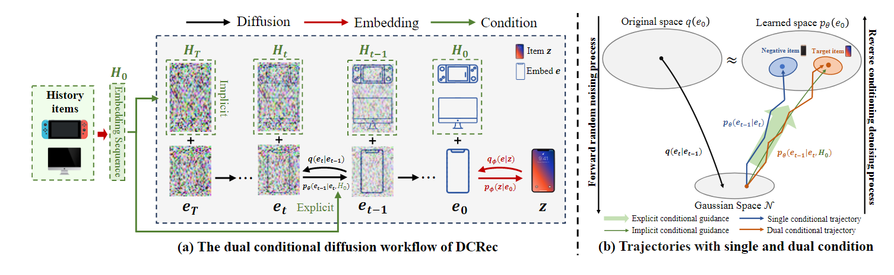
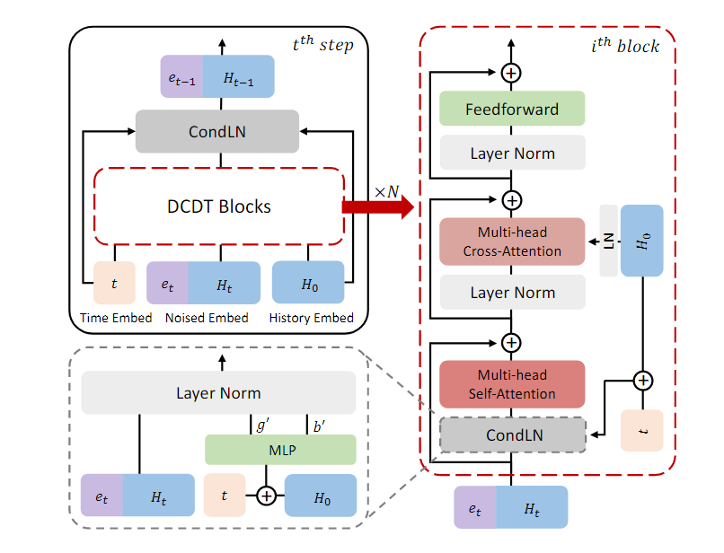

# [2024] DCRec

> Dual Conditional Diffusion Models for Sequential Recsommendation

$$
S_0 = Concat(H_0, e_0)
$$

其中$H_0$表示history item sequence，$e_0$表示target item

和DiffuRec对比如下：

$$
DCRec: \quad q(S_t|S_{t-1}) = \sqrt{\alpha_t}S_0 + \sqrt{1-\alpha_t}S_{t-1} \\

DiffuRec: \quad q(H_t|H_{t-1}) = \sqrt{\alpha_t}H_0 + \sqrt{1-\alpha_t}H_{t-1} 
$$

 