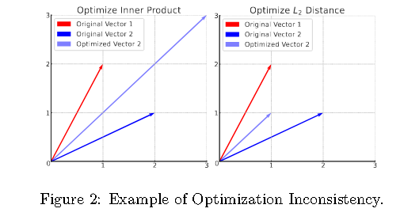

# [2024] DimeRec

> DimeRec: A Unified Framework for Enhanced Sequential Recommendation via Generative Diffusion Models（中科大）

<u>**前身是 ComiRec， 建议先看**</u>


DimeRec 协同结合了引导提取模块（GEM）和生成 扩散聚合模块（DAM）。 GEM 从用户的非平稳交互历史中提取关键的平稳指导信号，而 DAM 采用以 GEM 输出为条件的生成扩散过程来重建并生成一致的建议.

***近期 Diffusion 相关的序列推荐算法：***

- DiffRec(苏大) 合并了一个额外的转换，把item从离散空间映射到连续空间，噪声和去噪方法专门应用于target item

- DiffuRec在前向过程中利用 truncated scheduled Gaussian noise 来破坏target item embedding。此外还引入了 Transformer 的近似器结构在反向过程中预测 x0

- DreamRec 放弃了负采样，把推荐任务彻底变为**学习生成任务**，在特定数据集有效，但是在工业环境效果不佳

- DCDR 设计了一种新的离散条件扩散重排序框架，通过离散空间中的扩散过程逐步商城和优化推荐列表，但是，**仅适用于推荐重排序，不适用于检索阶段**

## Method


模型框架由两个相互依赖的模块组成：
1. 引导提取模块 ```GEM```
2. 扩散聚合模块 ```DAM```

In the first stage, GEM接受用户的原始行为序列Su，并提取出抽象的用户嵌入序列 gu

$$
G^u = GEM_{\phi}(S^u)
$$

现有的Diff推荐模型都是直接从整个用户的行为序列中提取和编码信息，然后将其作为扩散模块的去噪过程的指导。

但是相比于用户兴趣，用户行为历史是不平稳的，其模糊的信息可能会导致扩散模型的不稳定。

**GEM通过为特定任务设计的规则、强大的动态路由或自注意力来提取用户相对固定的兴趣**。


In the second stage，DAM充分利用扩散模型把上述用户嵌入序列gu聚合到latent embedding space，以生成最终的用户嵌入序列eu：

$$
e_u = DAM_{\theta}(g^u,x^t,t)
$$


## Guidance Extraction Module (GEM)

**Rule-based GEM**,这种情况下GEM没有可学习参数，一般根据实际情况设计规则，如再本项目中，将 Su 的大小 N 削减到更小的 K， 就可以通过对 Su 进行列表切片并编码为连续空间来获得指导：
  
$$
g^u = F(S^u[-K:])
$$

切片选择了 Su 的后K个子序列，F表示encoding function。


**Model-based GEM**，论文中通过 SA 进行编码，首先Su经过 F 编码之后获得 Hu，然后使用SA机制抽取注意力权重 A ：

$$
A = Softmax(MLP([4d, K], Tanh)(H^u + P))
$$

其中 K 是引导长度 （K << N）以便后续DAM高效执行。P表示standard global positional embeddings，这样最终的指导序列gu可以通过对Hu加权求和获得：

$$
g^u = A^TH^u
$$

**Loss Function**, 优化MLP中的可学习参数，通过引入 argmax 算子，根据生成的引导序列gu和目标嵌入ea之间的匹配程度来优化GEM模型：

$$
g_u = g^u[:,argmax(g^ue_a)]
$$

通过下列方式计算loss(本质上是个softmax)


$$

L_{gem}(\phi) = \frac{1}{|u|}\sum_{a\in I_u}-log(
    \frac{
        exp(g_u·e_a)
    }{
        exp(g_u·e_a) + \sum_{i^-\in I_{sample}}exp(g_u·e_{i^-})
    }
)
$$


## Diffusion Aggregation Module


**Denoising Model with Guidance**,通过基于指导序列gu，diffusion model可以用条件去噪模型来预测目标 x0 而不是噪声！

论文中通过一个简单的多层感知机来构建条件去噪模型：

$$
\bar{x_0} = f_{\theta}(x_t, t, g^u) = MLP(x_t, t, g^u)
$$

**Loss Function**,因为预测x0，所以简化训练目标学习MSE重建目标：

$$
L_{recon}(\theta)=E_{t,x_0,\in}[|| x_0 - f_{\theta}(x_t, t, g^u) ||^2_2]
$$

For the retrieval task, it's straightforward to optimize the sampled softmax loss on ˆx0 as:

$$
L_{ssm}{\theta} = \frac{1}{|u|}\sum_{a\in I_u}-log(
    \frac{
        exp(\bar{x_0}·e_a)
    }{
        exp(\bar{x_0}·e_a) + \sum_{i^-\in I_{sample}}exp(\bar{x_0}·e_{i^-})
    }
)
$$

最终，DimeRec的总损失通过联合学习GEM和DAM：

$$
L = L_{gem} + \lambda L_{recon} + \mu L_{ssm}
$$


## Geodesic random walk(含金量所在)

现存方法都是直接向item里面注入噪声，但是可能会导致重建损失和推荐损失之间的优化方向出现分歧。

This is mainly because optimizing to minimize the L2 distance usually involves reducing the magnitude of the vectors, while optimizing to increase the inner product typically consists of increasing the magnitude of the vectors。



如上图（左）所示，优化目标是增加vector1和vector2的内积，优化后，内积增大，但L2距离也会增大。

右图则相反，L2距离和内积都在减小，同时训练可能会导致优化中的不兼容性。


一个明显的解决方案就是把item表示映射到**球形空间，使其L2范数变为常数**.

## 消融实验

扩散模型可以提高模型的整体性能，DimeRec通过DAM学习用户的下一个兴趣的分布，比确定性兴趣向量具有不确定性和多样性。最后的结论是DimeRec的分类任务的线性探测精度高于其他模型，表示可以从交互历史中挖掘项目（例如类别）的隐藏信息，从而使得学习到的item表示空间更加优雅，以提高模型性能。

其实意思是，DimeRec推荐的种类多了，导致性能下降，但是换一种思路来想，推荐结果具备更多的多样性，而**推荐系统的主要目的是确保推荐的项目符合用户的兴趣**，所以DimeRec是推荐类别数量最多的模型，验证了可以增加推荐多样性。


可以看见 GEM 显著影响DimeRec的性能，这个是最终重要的！


## 附录

### 训练阶段伪代码


### 推理阶段伪代码


