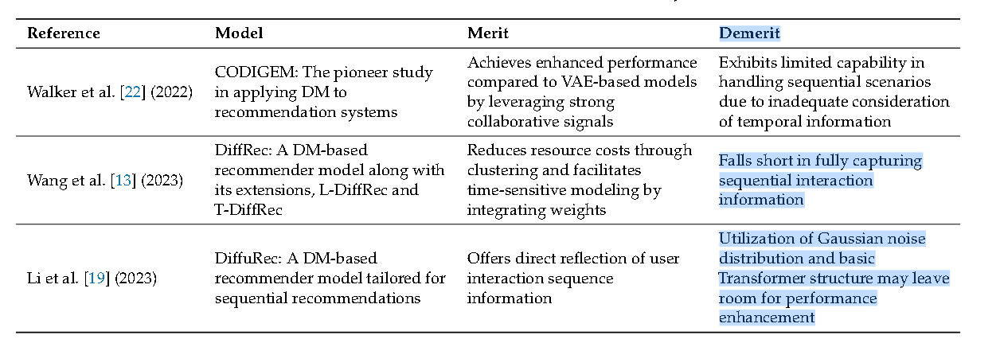
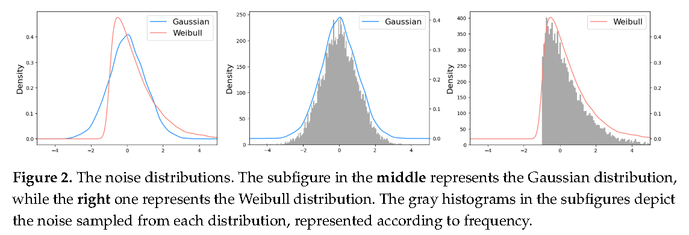
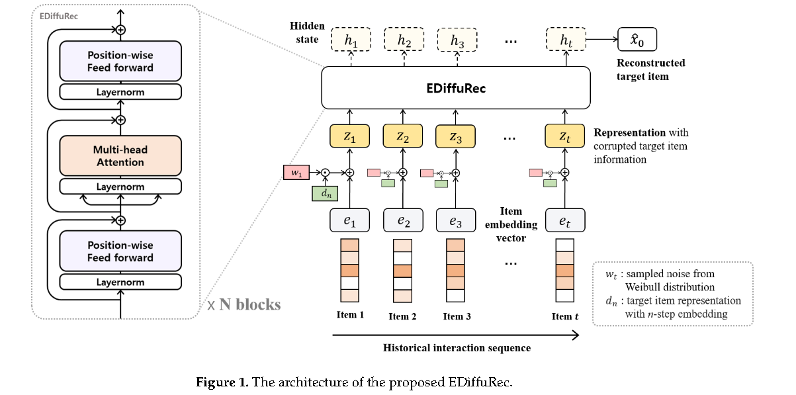
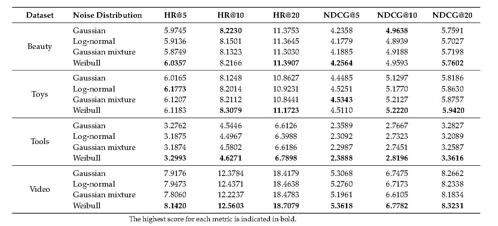

# [2024] EDiffuRec: An Enhanced Diffusion Model for Sequential Recommendation

mdpi,但是抄一手.

扩散模型通常利用均值固定为零的高斯分布，但通过采用更高自由度的分布，有可能提高生成模型的性能。EDiffuRec利用**新的噪声分布**。

生成推荐模型可以在缺乏交互信息的情况下生成没有交互的项目的概率，并通过学习噪声数据场景中的潜在特征来生成有用信息。

本文提出了一种基于威布尔分布的新噪声分布，并提出了基于Macaron Net修改Transformer架构，以及归一化损失和预热策略。

本文提出的有价值的表格：

意思是DiffuRec虽然可以直接反映用户交互信息，但是**直接利用高斯分布并且Transformer架构留下了提升空间**。

EDiffuRec的Macaron Net也是一种Transformer-based model，包含一个多头注意力模块和两个FFN模块，并且FFN的输出需要乘0.5

通过Weibull重写加噪：

$$
x_t = \sqrt{1 - \beta_{t}}x_{t-1} + \sqrt{\beta_t}w_t
$$

其中

$$
w_t \sim Weibull(k_t, \lambda_t) + c
$$

由于weibull噪声只允许取非负数，所以定义了一个变量c，用来反映不同范围内的噪声。

$$
f(x) = \begin{cases}
    \frac{k}{\lambda}(\frac{x}{\lambda})^{k-1} e^{-(\frac{x}{\lambda})^k} + c  && c>=0 \\
    0  && c<0\\
\end{cases}
$$

Weibull分布可以使用两个**决定形状和尺度**的参数来推导各种分布，以通过考虑不同类型的噪声来实现更加精确的建模。

同时由于Weibull分布是不对称的，可以减轻噪声或异常值的影响。

剩下文章就没啥了，主要是weibull分布和修改后的Transformer架构。

