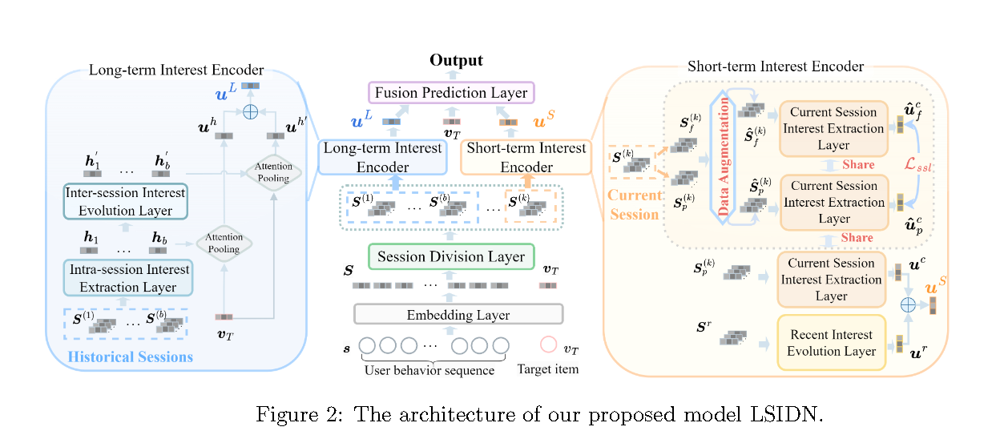
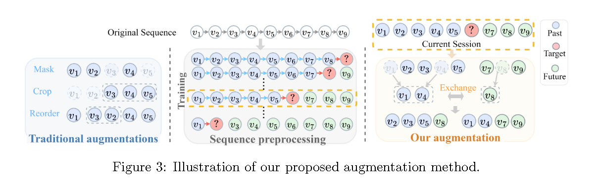
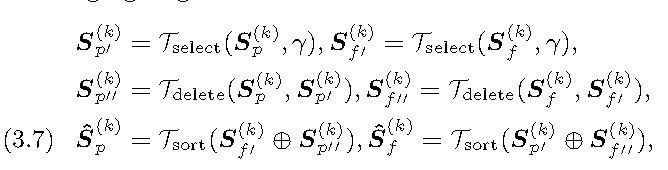
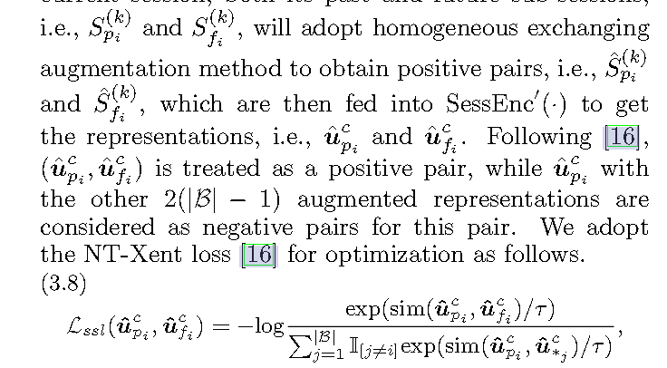
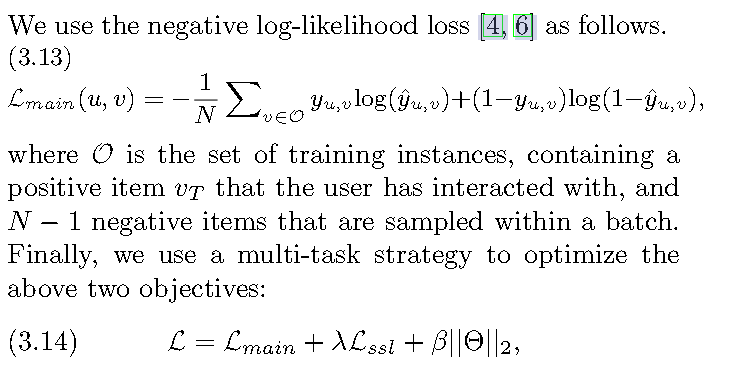

# [2024] LSIDN


> Denoising Long- and Short-term Interests for Sequential Recommendation(中科院、重庆大学)

代码：https://github.com/zxyllq/LSIDN.git （Microsoft Recommendation + TF）


用户兴趣在不同的时间尺度上看，可以分为长期偏好和变化的短期注意。现在的关注不同时间尺度的论文忽略的不同时间尺度的负面影响（**本文类似复旦2024的UniRec，都是关注时间间隔**）

本文提出了一种结合长期和短期兴趣的去噪网络，采用不同的编码器和定制的去噪策略来分别提取长短期兴趣，实现全面和鲁棒的用户建模。


【长期】具体来说，LSIDM采用 **a session-level interest extraction and evolution strategy** ，以避免 inter-session behavioral noiseinto long-term interest modeling。

【短期】同时采用 **contrastive learning equipped with a homogeneous exchanging augmentation** 来缓解 the impact of unintentional behavioral noise on short-term interest modeling。


## Model





首先 LSIDN 通过 session division layer 对seq进行长短期划分，之后使用 long-term 和 short-term encoder 分别对划分之后的session进行编码建模，最后通过融合预测层聚合不同时间尺度的用户兴趣，然后进行推断。

---

### Session Division Layer

user behavior交互seq会被item embedding编码为嵌入矩阵E，然后通过Session division layer进行划分，定义了一个阈值w，如果两个item交互时间小于阈值w就表示为同一个session，否则就是两个连续的session，最后可以可以把seq划分为以下形式：

$$
[S^{(1)}, S^{(2)},...,S^{(n)}, ..., S^{(k)}] = SessDiv(S, w)
$$

其中 k 是划分后session数量， 每一个 S 就是划分之后的 session embedding matrix

---

### Long-term Interest Encoder

通过session division之后，得到了 k 个 sessions，然后选取了较早的 b （b <= k）个sessions送到long-term encoder进行编码。

session内兴趣提取层，采用 Transformer 来提取 session 内的兴趣并表示为 SessEnc(·), 在 b 个 sessions 中共享， 表示为 ```[S(1), S(2), ..., S(b)]```， 给定的第 n （n <= b）个历史session，可以表示为：

$$
h_n = AvgPooling(SessEnc(S^{(n)}))
$$

以此，我们可以得到 b 个兴趣 ```[h1, h2, ..., hb]```。通过单独提取session 兴趣，可以绕过在整个序列上计算SA，可以被视为是局部注意力的一种形式，**有效避免了session间的行为噪声，即消除不同session之间的不相关行为之间的特征交互**.


**Inter-session Interest Evolution Layer**中采用 GRU 来**捕获历史兴趣的演化**， 其中session间兴趣表示为GRU的隐藏状态：

$$
[h_1^{\prime}, h_2^{\prime}, ..., h_b^{\prime}] = GRU([h_1, h_2, ..., h_b])
$$

之后模型采用了一个 **attention pooling**来在用户的多个session级兴趣和target item之间进行软对齐。

对于用户的session间兴趣```[h1, h2, ..., hb]```,有：

$$
u^h = AttnPool(v_T, [h_1, h_2, ...., h_b]) = \sum_{i=1}^ba_ih_i,\\
a_i = \frac{exp(h_iWv_T^T)}{
    \sum_{j=1}^b exp(h_jWv_T^T)
}
$$

其中 W 是可学习参数，类似地对GRU处理之后的数据也进行上述操作，生成 uh', 最终，用户的长期兴趣可以表示为：

$$
u^L = Concat(u^h, u^{h\prime})
$$

---

### Short-term Interest Encoder

论文选取当前session Sk 作为短期序列，但是最后一个序列可能只有一两个item，所以选取了最后的 r （r < T-1）项items补充到Sk中作为input。


**Current Session Interest Extractor Layer**， 文章使用了一个和SessEnc相同结构的编码器 SessEnc'(·) 来进行建模：


$$
u^c = AvgPooling(SessEnc\prime(S^{(k)}))
$$

然后有限长度会使得当前session对噪声更加敏感，因此采用对比学习来增强效果。


由于传统顺序增强可能会破坏item之间的关系或者使得seq中的item数量过少，论文提出了一种针对短序列的新数据增强方法。此方法**使用原始当前会话的后缀作为附加信息来创建可靠的自监督信号**。





由于会话内行为的同质性，用户在过去和未来子会话中的兴趣高度相似，因此我们随机交换两个子会话中的项目来构建正对。

首先论文中过去和未来的子session中随机选择一定比例的items，然后swap这些选中items，并合并获得最终的增强正对。这种同质增强可以表示为：







**Recent Interest Evolution Layer**，论文选择最新的r个items作为 recent sub-sequence，

$$
S^r = [v_{T-r-1}, v_{T-r}, ..., v_{T-1}]
$$

论文采用 ```Time4LSTM``` 作为注意力池以获得最近的用户兴趣表示：

$$
u^T = AttnPool(v_T, Time4LSTM(S^r))
$$

我们将近期兴趣演化层设置为仅在当前会话极短时才使用的选项，并将r设置为尽可能小以平衡有效性和效率, 最终短期注意力可以表示为：

$$
u^S = Concat(n^r, u^c)
$$

---

### Fusion Prediction Layer

这个层中模型自适应的融合长短期信息：

$$
\alpha = Sigmoid(W^m Concat(u^L, u^S, v^T) + b_m), \\

u^{LS} = \alpha u^L + (1 - \alpha)u^S
$$

其中 W 和 b 都是可学习参数，最后模型在用一个 MLP 去预测target item vT

$$
\hat{y_{u, v}} = Sigmoid(MLP(Concat(u^{LS}, v^T)))
$$

损失如下：




## Analysis

1. 长短期兴趣模型，在大多数情况下都要优于简单的整体兴趣模型，展现了联合建模不同时间尺度的用户兴趣的优越性
2. 去噪序列模型在绝大多数情况下优于非去噪模型

