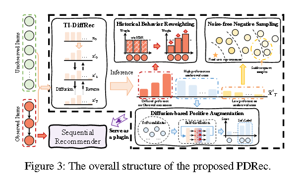

# [2024] PDRec

> Plug-in Diffusion Model for Sequential Recommendation(山大、腾讯)
> https://github.com/hulkima/PDRec

本文的思路为：通用的推荐使用语料库中得分最高的item来进行用户兴趣预测，这会导致忽略其余item中包含的用户广义偏好.

具体步骤中PDRec先通过time-interval diffusion model来生成用户对所有item的偏好，并且通过融合历史行为重加权（HBR）来识别高质量行为。

同时论文还提出了一种基于diffusion的正增强策略DPA，利用排名靠前但是未被观测到的项目进行潜在正样本，引入信息丰富并且多样化的软信号来缓解数据稀疏性。

## Introduction

文章提出DiffRec等模型根据user 历史交互数据进行扩散，但是存在两个挑战：
1. 如何充分利用DM的广义用户偏好
   
   如diffrec等模型，只是输出了语料库中得分高的item，但是却忽略了用户对于其余item的偏好。

2. 如何基于Diffusion的知识构建一个可以与不同SR Model写作的通用框架？

    【这是本文提出的创新点，也就是提出了插件化序列推荐Diff-based model，但是在同年港大的DiffCLRec中也对这个问题进行了回答】

    ***可以提出一个新的解决思路？使用plug-in diffusion model去提取广义的用户偏好，然后使用港大的思路集合上下文（BERT）和HBR生成私有用户的个人偏好，结合（cat）之后进行CL training***

### step.1 time interval process

$$
w^j_u - w_{min} + \frac{t^j_u - t^i_u}{t^p_u - t^1_u}(w_{max} - w_{min})
$$

其中w_max和w_min是预先定义好的上下界，

### step.2 diffusion block

PDRec的前向加噪本质上还是一个马尔可夫链，还没看代码，但是应该也可以抽象为:

$$
x_t = \sqrt{\alpha}x_0 + \sqrt{1-\alpha}\theta
$$

插件Diffusion中先把数据根据时间信息进行整理，然后作为新的x_0送到diffusion中进行扩散训练，输出的高阶数据再融合HBR等，输出用于SR Model。

### step.3 HBR

用户序列中不同item对于next item的预测应该具有不同程度上的重要性，因此，历史偏好建模（HBR）的关键在于对所有观察到的item进行适当性和细粒度的区分。

HBR对行为序列去噪训练中的监督信号进行重新加权，具体步骤为：

1. 原始用户交互x_0, 通过step1获得 x_0`
2. 使用diffusion模型进行推理，生成基于扩散的用户对所有item的全局偏好x_0``
3. 为了对历史行为重新赋权，使用当前用户u可以被观察到的偏好（observed preferences） o和对应的排序（their corresponding ranking） r 进行重新加权。

$$
\widehat{w_u} - (1-w_r)w_s\frac{o_u - min_{o_u}}{max_{o_u} - min_{o_u}} + w_r\frac{1+max_{r_u}-r_u}{max_{r_u}}
$$

通过HBR，我们不仅可以 直接关注与用户行为相关的时间间隔感知偏好，还可以利用DM的信息不确定性来对可有可无的项目进行去噪，并突出显示用户行为序列中不可或缺的动作

### step.4 DPA

将预训练的 TI-Di̯ffRec 中的广义知识 转移到顺序推荐器中

首先从potential soft samples中选取top-k，通过***用户行为序列中的 最后一个行为反映了他/她的整体兴趣***， PDRec计算matching socre m_u，然后重新get top-k

### step.5 NNS

PDRec 引入了无噪声负采样（NNS）策略来优先 考虑低分未观察到的样本基于扩散的偏好，选择安全的负样本来引导HBR和DPA朝着稳定的优化方向前进.

与DPA利用高偏好的未观察项目作为软正增强相比，NNS创造性地将这些低偏好的项目作为训练中的附加负样本.

