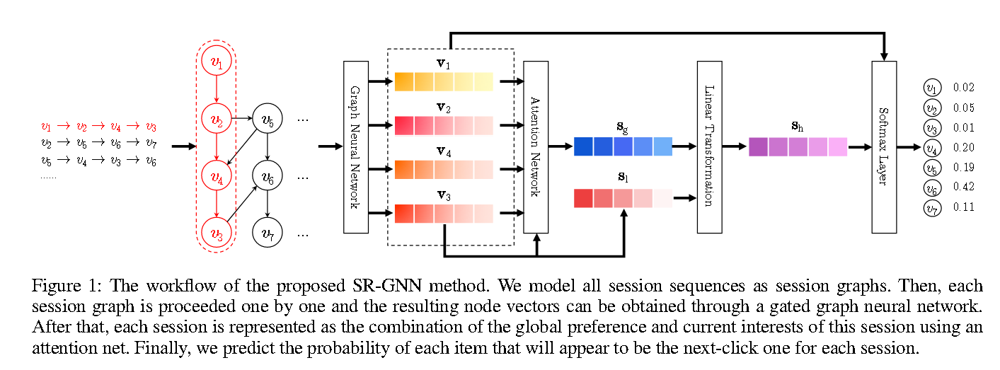
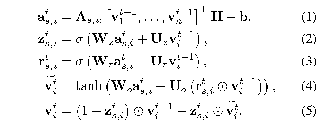
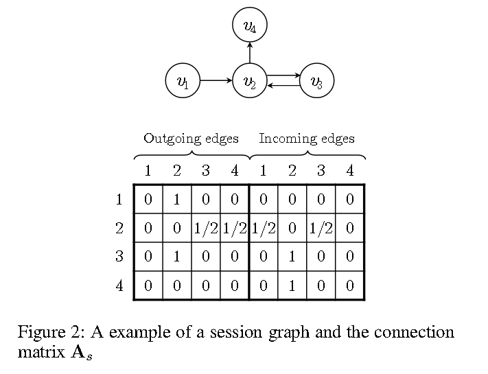

# [2019]SRec-GNN

> Session-based Recommendation with Graph Neural Networks (中科大)

目标：model limited behavior in one session and generate the recommendation accordingly.

过去的实验（2019年之前，session rec）集中于马尔科夫链、RNN、MLP+Attention，主要的问题如：

1. without adequate user behavior in one session, these methods have difficulty in estimating user representations
2. these methods always model singleway transitions between consecutive items and neglect the transitions among the contexts





## Introduction

**first construct directed graphs from historical session sequences**


创新点：

1. <del>首次用图进行sequence推荐</del>
2. 通过每一个session中潜在的items向量所生成的sesion embedding来替代user presentation，来进行session-based rec
3. 达到了sota
   

## The Proposed Method

session-based rec的主要任务是预测user下一个将会点击的item，仅基于用户当前的顺序会话数据（非长期）

> session-based 和 sequence-based 的区别，session集中在短期兴趣，而sequence是长期用户交互和历史记录

### Notations

所有item表示为V，其中：
$$
V = \{v_1, v_2, ..., v_m\}
$$

匿名session sequence ```s```序列按照times tramp排序，表示为：
$$
s = [v_{s, 1}, v_{s, 2}, ..., v_{s, n}]
$$
其中v表示用户user在当前session中和某个item交互的记录，主要目标为预测下一次交互（click）的item，表示为：
$$
v_{v, n+1}
$$
最后输出所有可能items的value的得分
$$
\widehat{y}
$$
vector y中的每一value为对应可能item的得分，y中的top-K将会用于推荐.


### *Learning Item Embeddings on Session Graphs*



To be specific, we can concatenate features with node vector to deal with such information.事实上在2019年的SR-GNN中就提出了可以扩展item embedding的思路。




###  *Generating Session Embeddings*

To better predict the users' next clicks, we plan to develop a strategy to combine long-term preference and current interests of the session, and use this combined embedding as the session embedding.


在文章中提供了local session和global session，其中local session s1=vn，global session如下：

$$
\alpha_{i} = q^T * \sigma(W_1*v_n + W_2 * v_i + c)
$$

$$
S_g = \sum_{i=1}^{n}{
    \alpha_i*v_i
}
$$

最后对local session和global session串联后进行线性变换

$$
S_h = W_3*[S_1; S_g]
$$

### *Making Recommendation and Model Training*


score zi:
$$
\widehat{z_i} = S_h^T * v_i
$$

output vector y:
$$
\widehat{y} = softmax(\widehat{z_i})
$$

最后用一个交叉熵算总的loss

