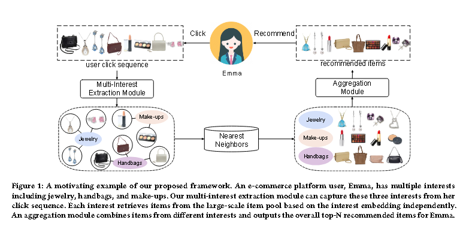

# [2020] ComiRec

> Controllable Multi-Interest Framework for Recommendation(清华，阿里)

ComiRec提出了一种新颖的可控多兴趣序列推荐框架，多兴趣模块从用户行为序列中捕获多种兴趣，可用于从大规模项目池中检索候选项目，然后把这些items输入到聚合模块以获得最终结果。

上图表示了当时（2020）年序列推荐中的一些问题，即统一的用户嵌入可能代表多种兴趣，如上图中的女孩对珠宝、手袋、化妆品都感兴趣，因此最后在用户记录中这三个类别都会出现。

而ComiRec的多级兴趣模块可以捕获用户的多种兴趣，用于检索候选items，上图最后就是ComiRec的示例。

