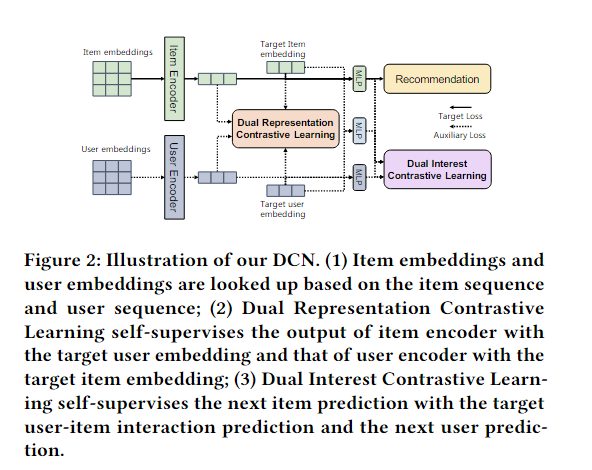
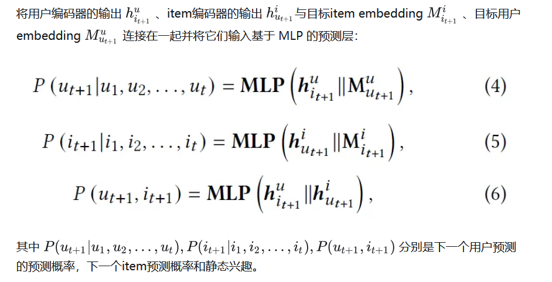
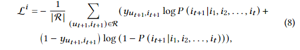
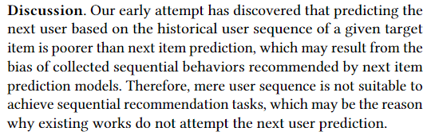

# DCN

> Dual Contrastive Network for Sequential Recommendation(清华)

清华的代码为什么不敢开源，是因为不想吗

提出了双对比网络DCN从利用辅助的用户序列的新角度来提升序列推荐：
- 双重表示对比学习，它最小化用户、item embedding和用户、item的序列表示之间的距离
- 双兴趣对比学习，旨在通过辅助训练对静态兴趣和下一个item预测的动态兴趣进行自监督

22年之前受到的影响为：
- Sparse sequential behaviors
- Obscure self-supervised signals

## Method

- 序列编码层。分别使用用户编码器和item编码器来捕获给定目标item和用户的user-to-user、item-to-item转换模式。
- 双重表示对比层。将用户编码器和item编码器的输出分别视为目标item和目标用户的表示，并提出双重表示对比学习以使用目标item embedding和目标用户embedding来自监督。
- 混合预测层。对于动态兴趣，我们通过将目标用户（或item）的embedding与用户编码器（或item编码器）的输出拼接输入MLP来预测下一个用户（或下一个item）。对于静态兴趣，通过将目标用户的embedding和目标item的embedding输入到预测层来预测目标用户和目标item之间的交互。
- 双兴趣对比层。提出双重兴趣对比学习，用静态兴趣自监督下一个item预测的动态兴趣。此外，还用下一个item得分自监督下一个用户得分。

---

$$
E^u = [M^u_{u1}, M^u_{u2},...,M^u_{ut}] \\

E^i = [M^i_{i1}, M^i_{i2},...,M^i_{it}]
$$

上述为user embedding和item embedding，之后送到编码器里面（文中使用SLi-Rec，也可以替换为GRU4Rec，SASRec等）。

$$
h^u_{i_{t+1}} = Encoder_u(E^u) （1）\\

h^i_{u_{t+1}} = Encoder_i(E^i) （2）
$$

其中 （1）表示**目标item it+1 的用户序列** 和 **目标用户 ut+1 的item序列的隐藏状态**

双表示对比层中，将上一步得到的 （1） 和 （2） 分别作为目标item和目标user的表示，然后把它们和目标item embedding Mi 和 user embedding Mu进行对比学习：

$$
loss^e = \lambda_e((h^u_{i_{t+1}} - M^i_{t_{t+1}})^2 + (h^i_{u_{t+1}} - M^u_{u_{t+1}})^2)
$$

其中 lambda^e 表示L2正则化参数。

在混合预测层中：

双重兴趣对比层中，倾向于在感兴趣的方面进行对比层。在混合预测层中获得了下一个用户预测、下一 个项目预测和静态兴趣的预测分数。

论文把它们混合在一起以实现相同的优化目标。

这里有一个问题就是得到下一个用户预测得分（概率） ，下一个item预测得分（概率） ，和静态兴趣得分 之后最终的预测形式是什么样的，怎么将这三部分融合到一起来进行预测。我猜想的一种简单方案就是直接人为赋权重简单加权。

论文直接人为手动赋权了？？

$$
loss^p = \lambda_p(
    (P(i_{t+1}|i_1,i_2,...,i_t)
    -
    P(u_{t+1}, i_{t+1}))^2
    +
    (
        P(i_{t+1}|i_1,i_2,...,i_t)
        -
        P(u_{t+1}|u_1,u_2,...,u_t)
    )^2
    )
$$

lambda^p 同样是L2正则化参数，这里作者没有对这个公式进行解释，估计凑出来的

## Optimization

utilize the widely-used LogLoss function as the main loss function, formulated as follows：

其中R是训练集，最终loss表示为：

$$
loss = loss^i + loss^e + loss^p + \lambda||\Theta||_2
$$

### Discussion

这段话的意思是：推荐系统通常有两种预测任务：一种是预测下一个用户（即预测下一个与系统交互的用户是谁），另一种是预测下一个项目（即预测用户接下来可能感兴趣的项目或物品）。这段话指出，在早期的尝试中，基于用户的历史行为序列来预测下一个用户的表现，比预测下一个项目的表现要差。这可能是由于预测模型在收集用户行为数据时存在偏差，导致模型对用户序列的预测不够准确。

其实意思就是去预测下一个交互的item，不要去预测user，效果会差。

## Conclusion

本文将用户序列与自监督学习相结合，而不仅仅只是单纯的从item序列中学习。这种探索不仅用用户序列补充了现有的序列推荐，而且还解决了利用自监督学习通过 dropout 策略生成增强数据存在的挑战。

提出了融合用户序列的有效性！