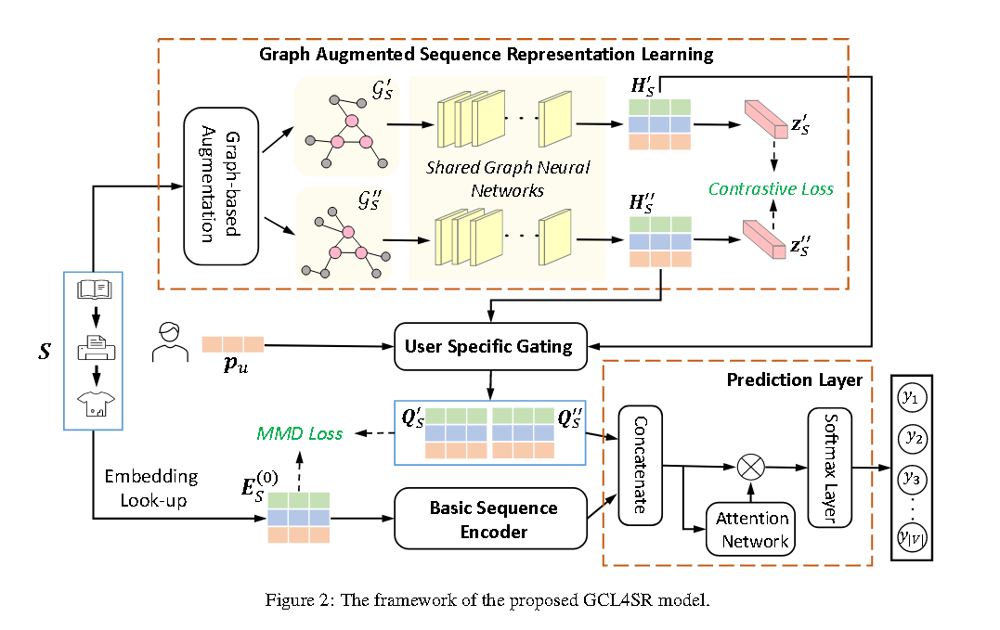

# GCL4SR

> Enhancing Sequential Recommendation with Graph Contrastive Learning(山大)

当前缺点：大多数现有的顺序推荐方法仅利用单个交互序列的本地上下文信息，并仅基于项目预测损失来学习模型参数

文中提出了三个部分：
1. 基于图增强的序列表示学习
2. 特定用户的门控
3. basic sequence编码器
4. 预测层

## 1. Graph-based Augmentation

通过扩充补充两个子图view，然后进行对比学习训练。

## 2. User-specific Gating

由于每个用户可能只对项目的某些特定属性感兴趣，因此全局上下文信息应该是用户特定的，通过特定门控**以捕获根据用户的个性化偏好量身定制的全局上下文信息**

$$
Q_s^` - H_s^`* \sigma(H_s^`W_{g1} + W_{g2}p_u^T)
$$