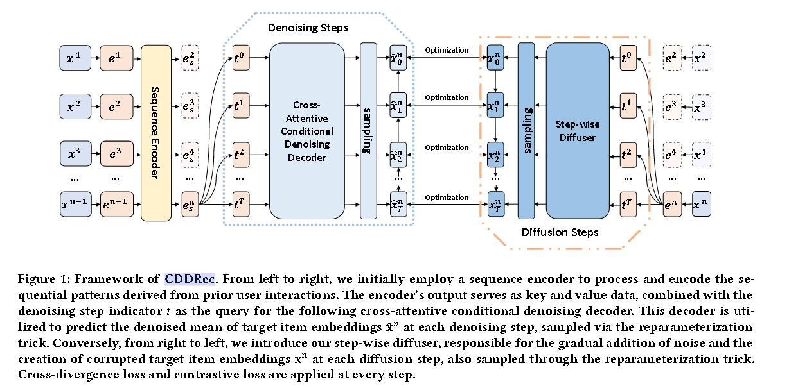

# CDDRec

> Conditional Denoising Diffusion for Sequential Recommendation(University of Illinois Chicago Chicago, United States)

代码：https://github.com/YuWang-1024/CDDRec

CDDRec提出了一种条件去噪扩散模型，包括：**序列编码器、交叉注意力去噪解码器 和 逐步扩散器**

这种方法通过以**条件自回归的方式**将优化和生成过程划分为更加容易且易于处理的步骤来简化优化和生成过程。

同时CDDRec引入了一种新的优化方式：**结合了交叉散度损失和对比损失，使模型能够生成高质量的序列/项目表示，同时防止崩溃**。

生成模型的缺点：由于item的不确定性等因素，生成模型容易在候选item上产生相似的排名分数。

去噪扩散模型（DDM）分为：扩散和去噪 两个阶段。

但是在顺序推荐的背景下，DDM期望的结果是**生成反映用户偏好的高质量seq/item表示，从而能够根据先前的交互记录预测下一个可能的item**，仅仅重建序列中的原始item表示，可能会加剧DDM的崩溃问题。

DDM的生成过程是**无条件和非自回归的**，并不适合顺序推荐，具体来说，DDM的生成是从随机初始化的高斯噪声开始的，这是不可控的。

所以CDDRec设计模型：**可以生成以 先前交互 为条件的下一个item的表示，即有条件地自回归生成序列表示**。

