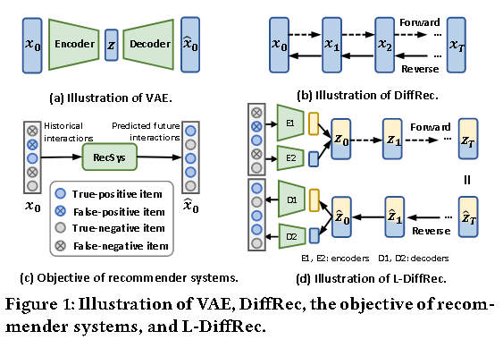
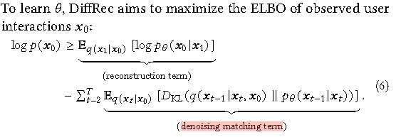
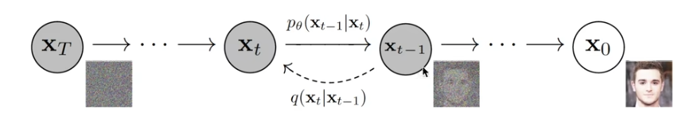
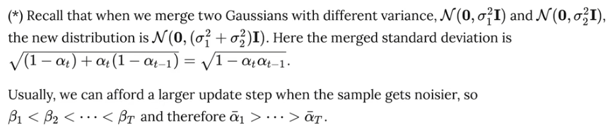
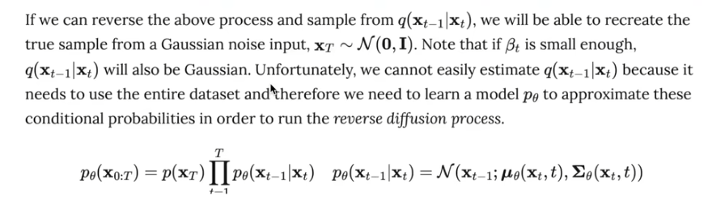

# [2023]DiffRec

> Diffusion Recommender Model(新加坡国立)
>
> 第一篇将diffusion用于推荐的论文


Diff-Rec提出了两个变体：
1. ：L-DiffRec 对item进行聚类以进行维度压缩，并在潜在空间中进行扩散过程 
2. T-DiffRec 根据交互时间戳重新加权用户交互以编码时间信息

## Generative recommender

生成推荐模型主要分为两类：

### GAN-based models

utilize a generator to estimate users' interaction probabilities and leverage adversarial training to optimize the parameters 

对抗性训练通常不稳定，导致性能不理想

### VAEs-based models

use an encoder to approximate the posterior distribution over latent factors and maximize the likelihood of observed interactions

但 VAE 却面临着易处理性和表示能力之间的权衡问题。易于处理且简单的编码器可能无法很好地捕获异质用户偏好，而复杂模型的后验分布可能很棘手





DiffRec 通过在前向过程中注入预定的高斯噪声来逐渐破坏用户的交互历史，然后通过参数化神经网络迭代地从损坏的交互中恢复原始交互。

L-DiffRec 将项目聚类成组，通过组特定的VAE将每个组上的交互向量压缩为低维潜在向量，并在潜在空间中进行正向和反向扩散过程。L-DiffRec显着减少了模型参数和内存成本，增强了大规模项目预测的能力。

T-DiffRec 通过简单而有效的时间感知重新加权策略对交互序列进行建模。直观上，用户后来的交互被分配更大的权重，然后输入 DiffRec 进行训练和推理。


## DiffRec Training



the prior matching term被忽略，因为是一个常数

reconstruction term表示从t状态重建t-1状态的概率

因此优化取决于最大化重建项和噪声匹配项


## Diffusion



前序扩散和反向生成。

### 正向过程

给定初始数据分布的 ```x0 ~ q(x)```, 可以不断地向分布中添加高斯噪声，该噪声的标准差是以固定值 βt 而确定的， 均值是以固定值 βt 和当前 t 时刻的数据 xt 确定的。**整个过程是一个马尔科夫链**。

随着t的不断变大，最终数据分布 xT 变成了一个各向独立的高斯分布。


$$
q(X_t | X_{t-1}) = N(
    X_t;
    \sqrt{1-\beta_{t}} X_{t-1},
    \beta_{t}I
)
$$

$$
q(X_{1:T} | X_0) = \prod_{t=1}^T{q(
    X_t | X_{t-1}
)}
$$

但是任意时刻的 q(xt) 推导也可以完全基于 x0 和 βt 计算出来，而不需要进行迭代计算。

前向传播中 t 时刻的 xt, z为高斯噪声，公式为：

$$
X_t = \sqrt{\alpha_t} X_{t-1} + \sqrt{1-\alpha_t} Z_{t-1} \\
= \sqrt{\widehat{\alpha_t}} X_0 + \sqrt{1-\widehat{\alpha_t}}Z \\


let \alpha_t = 1-\beta_t \quad and \quad \widehat{\alpha_t} = \prod_{i=1}^T{\alpha_i}

\\
q(X_t | X_0) = N(X_t;
\sqrt{\widehat{\alpha_t}}X_0,(1-\widehat{\alpha_t})I)
$$




## 重建过程 逆过程

逆过程是从高斯噪声中恢复原本的数据，可以假设他也是一个高斯分布，但是无法逐步拟合分布，所以需要构建一个参数分布去做估计。**逆过程仍然是一个马尔科夫链**。



