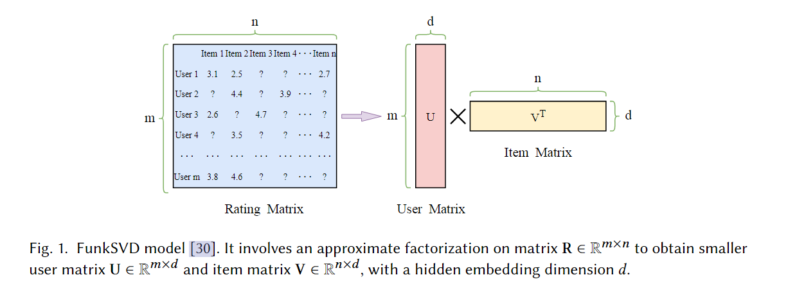
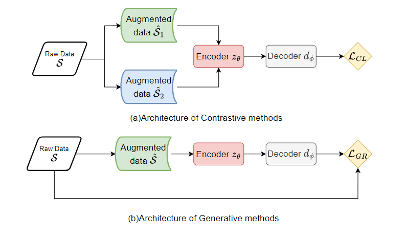
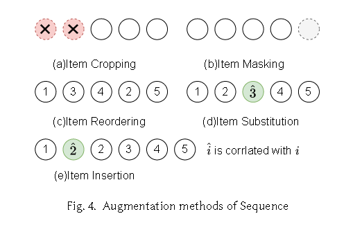

# Embedding in Recommender Systems: A Survey

> Embedding in Recommender Systems: A Survey(香港城市大学，百度，香港理工，密歇根州立大学，字节跳动)

> 主要集中在Graph，对序列没什么帮助

推荐系统中的一个关键技术就是把高维离散特征（例如用户、item id）转换为低维连续向量以增强推荐性能。

代码： https://github.com/Applied-Machine-Learning-Lab/Embedding-in-Recommender-Systems

论文提出主要用来捕获实体embedding的技术有：CF、自监督学习和基于图的技术。同时，AutoML、哈希技术和量化技术也被探索作为提高基于嵌入的推荐系统的性能和效率的方法。

本片论文的主要焦点是**自监督学习中数据的图和序列结构**

# CF

一般来说，CF是学习用户和物品之间的相似性以及用户行为，然后预测潜在的首选物品进行推荐.

通过CF实现嵌入的方法主要有两种：
1. MF 矩阵分解
2. FM 分解机

MF是将用户评分矩阵分解为**用户特征矩阵**和**项目特征矩阵**的广义乘积，然后根据用户对项目的偏好来实现推荐，可以通过相应的用户嵌入向量和项目嵌入向量来计算.

但是由于one-hot编码地分类特征，会导致大量的稀疏数据，因此提出了 FM 策略，将one-hot embedding转换为特征embedding，然后学习不同特征之间的embedding相似度来预测性能。

## Matrix Factorization Scheme

奇异值SVD分解是最常见的矩阵分解方法，对 [m, n] 矩阵（m个用户，n个items）进行近似分解，从而获得较小的用户矩阵U和较小的物品矩阵V，并具有a hidden embedding dimension d :

$$
R \approx U * V^T
$$

其中U和V分别表示user和item **不可解释**的潜在特征，并且最终的优化对象设计为：

$$
min_{u_i,v_j} \sum_{{(i, j)|R_{i,j} \notin \phi}} (R_{ij} - v^T_ju_i)^2 + \lambda(||u_i||^2 + ||v_j||^2)
$$

## Factorization Machines

解决大规模稀疏数据分类挑战的解决方案在于特征组合,FM有效地压缩了大量稀疏特征，减少参数大小，同时保证了性能。

根本上，FM使用潜在因子的点积替代了正则逻辑回归中的交互项，对于输入特征向量x，分解机中次数d=2的输出值FM(x)如下：

$$
\phi_{FM}(x) = w_0 + \sum^n_{i=1}w_i x_i + \sum^n_{i=i}\sum^n_{j=i+1}<v_i, v_j>x_i x_j
$$

其实 vi 和 vj的点积应该是表示 wij，而FM通过这个替换有效的实现了因式分解的过程。

# SSR

自监督任务的形式如下:

$$
z_{\theta^*}, d_{\phi^*} = argmin_{z_\theta, d_{\phi}} L_{ssl}(d_{\phi}(z_{\theta}(S, \hat{S})))
$$

上述例子中 S 表示原始数据， hat S表示增强（损坏）数据

𝑧𝜃 is the encoder parameter to generate the node embedding vector

𝑑𝜙 is the decoder to learn its own parameter 𝜙 and refine the encoder parameter 𝜃 for the main recommendation task

学习嵌入参数是SSR模型的一部分过程，监督信号从raw data中半自动生成，根据辅助任务类型，可以分为：对比式和生成式。

## CL

其目的是通过最小化嵌入空间中同一样本的视图之间的距离和最大化不同样本的视图之间的距离来生成自监督信号。

一个CL包含三个组件：
1. data augmentation
2. sample encoder which is particular for the type of input (e.g., graph encoder and sequence encoder)
3. CL loss

SSR模型对原始数据采用增强方法，然后encoder对raw data 和 augment data转换为向量，最后对raw data 和 augment data通过CL损失最大化正对（即来自同一样本的增强数据）和负对（即来自不同样本的增强数据）之间的互信息。

**基于Graph data**的数据增强先略过，主要看**Sequence Data**上的CL增强。

