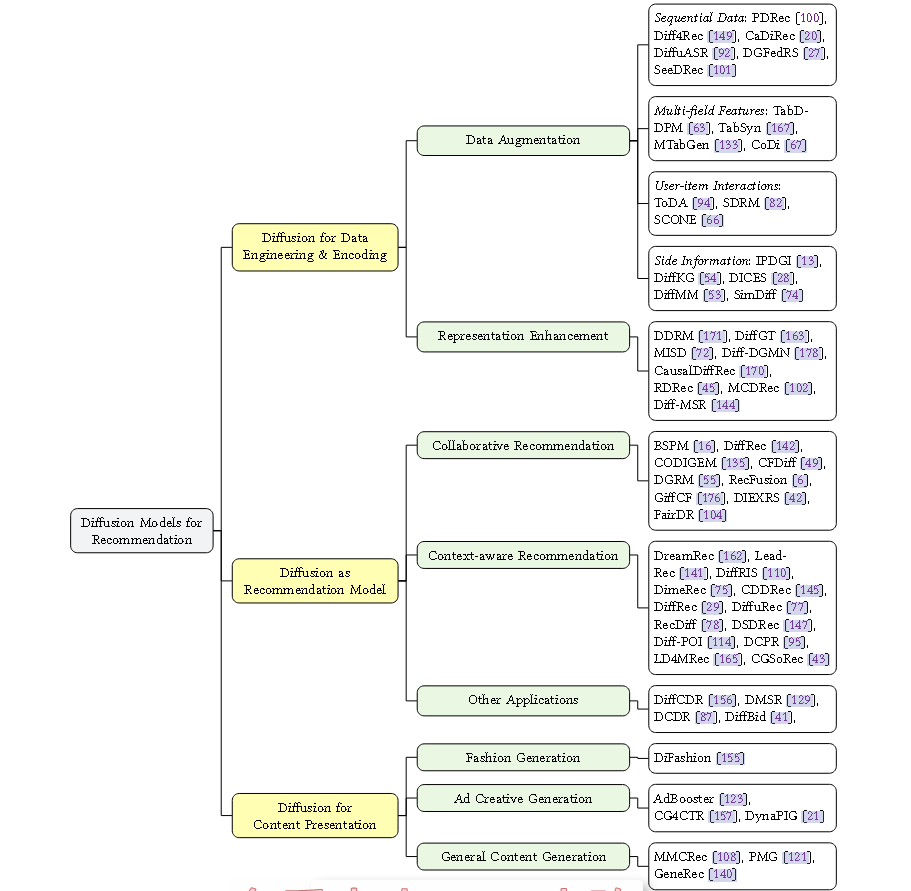

# [2024] A Survey on Diffusion Models for Recommender Systems

现在基于扩散的推荐主要集中于：
1. 专注于数据增强和表示增强
2. 扩散作为推荐模型直接估计用户偏好和排名项目
3. 内容呈现扩散，生成个性化内容，例如时尚、广告创意

综述的分类法强调了扩散模型在捕获复杂数据分布方面的独特优势生成与用户偏好密切相关的高质量、多样化的样本。

代码：https://github.com/CHIANGEL/Awesome-Diffusion-for-RecSys

主要集中将diffusion作为推荐模型，综述将这一类分为三种：collaborative recommendation, context-aware recommendation, and other applications.

