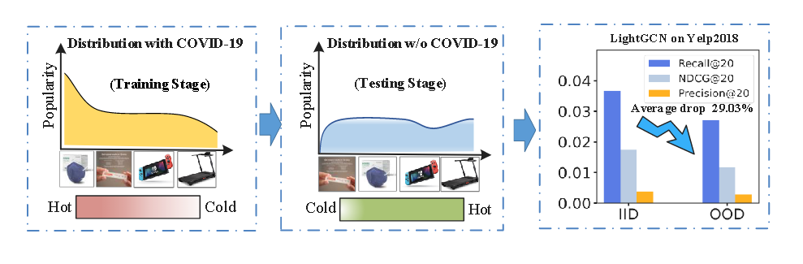
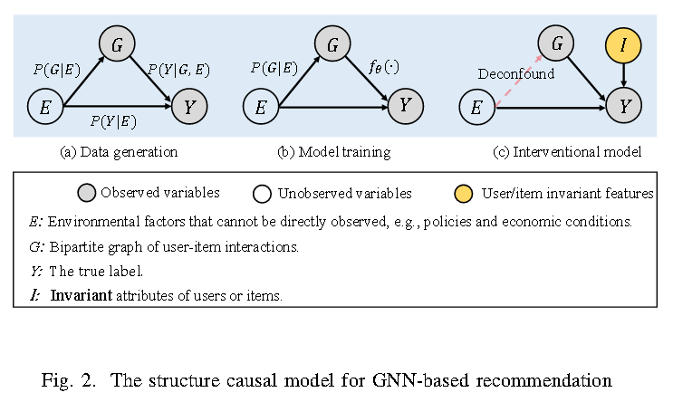
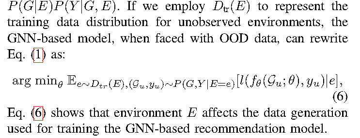

# [2024] CausalDiffRec

> Graph Representation Learning via Causal Diffusion for Out-of-Distribution Recommendation(东北大学)


代码：https://github.com/user683/CausalDiffRec

graph representation via causal diffusion for OOD recommendation，这种方式增强了模型在OOD数据上的学习能力，通过**eliminating environmental confounding factors and learning invariant graph representations**。


具体来说就是通过预训练了一个全局分布（real environment distribution）然后把这个分布作为先验知识去指导 Diffusion 在反向过程中学习不变的表示。


绝大部分 Graph-based 的推荐算法认为 training 和 testing 数据集的分布是独立的，并且主要都集中基于这个假设来提高推荐的效果。但问题是，这些方法对OOD数据效果很差，比方说：用户过去喜欢的商品类型可能不再反映他们当前的喜好，或者新用户的行为模式可能与训练数据中的用户行为模式不同。




上图的例子是，疫情期间居家隔离，在购买医疗产品的同时，会加大对健身器材和电子设备的需求，因此推荐算法可能会学习到买口罩的用户也会经常购买健身器材或电子设备。但是这种关联是因为“疫情”驱动的，而不是item之间的直接因果关系。因此当疫情结束之后，口罩的需求下降，对电子设备和健身器材的需求也会减少。这样推荐系统在训练阶段学习到的内容就是不稳定的，会导致新分布下的性能下降。


如SGL、SimGCL、LightGCL等 对比图学习方法**主要解决数据中的噪声或流行度偏差**问题，当测试数据分布未知或具有多个分布的时候，很难实现良好的性能。


论文首先构建**结构因果模型SCM**来分析数据生成过程，结论为：**潜在的环境变量可以导致基于 GNN 的算法捕获与环境相关的不稳定相关性**。论文提出CausalDiffRec，主要有三个模块：：环境生成器、环境推理和扩散模块。

环境生成器用于生成K个不同的图来模拟各种环境下的数据分布，之后，推断模块从这些生成的图中推断出环境成分，并作为扩散阶段的反向输入，用来指导不变图表示学习。


## 基于 GNN-based 的结构因果模型



### Causal View in GNN-based Recommendation

图中的三个因果关系都来自数据生成的定义：

- E 表示未观测到的环境因素（即突发热点事件或政策）
- G 和 Y 分别表示user-item交互图以及真实标签
- I 是用户和物品不受环境因素影响的不变属性，例如用户性别和物品类别信息

之前的工作标签，这些不变特征可以有效增强模型在OOD环境下的泛化能力。

- E -> G 环境对 user-item交互的直接影响定义为 ```P(G|E)```, 例如环境变量是天气，则用户在寒冷的环境中可能会更加频繁的与保暖的衣服互动。
- G -> Y 表示 user-item交互图G对用户行为标签Y的影响。基于GNN推荐模型 ```Y = f(G)```定义该关系
- I -> Y 表示不变的 user-item属性直接影响用户行为标签Y，例如，用户可能始终喜欢在特定餐厅用餐，并且餐厅的位置和名称等属性通常不会改变。
- E -> Y 表示环境直接影响用户行为标签 Y， 例如在特定的假期环境中，用户可能更倾向于购买与假期相关的物品，无论他们是否与这些物品进行过交互。

环境直接影响数据的分布和预测结果，可以明确表示为```P(Y,G|E)=P(G|E)P(Y|G,E)```





### Confounding Effect of E

当测试集的环境与训练集的环境不同时，这种关系变得不稳定且无效。

过度学习训练数据中的环境敏感关系的推荐模型在测试阶段面对分布外数据时将难以准确建模用户偏好，从而导致推荐准确率下降


### Intervention


为了消除环境对模型能力的影响，需要指导模型学习 ```P(Y|do(G))```而不是```P(Y|G)```，在因果理论中，do操作意味着消除目标变量和其他变量之间的依赖关系。

