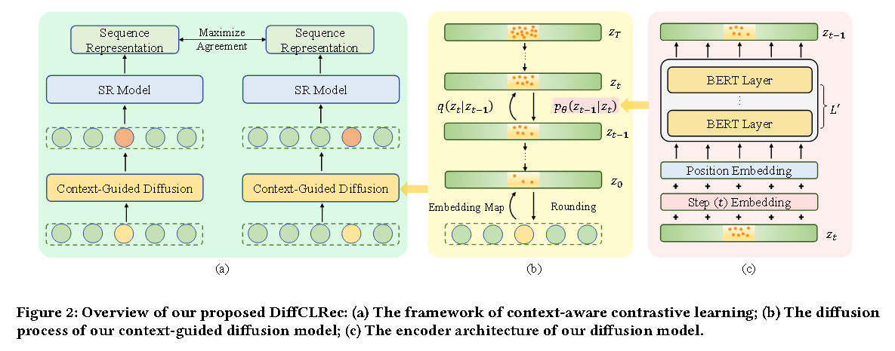

# [2024]DiffCLRec

> Diffusion-based Contrastive Learning for Sequential Recommendation(香港城市大学)
> 
> 将diffusion和对比学习用于序列推荐

## 摘要

对比学习主要用来：缓解数据稀疏问题和增强推荐效果，对比学习的目标是 ***最小化同一用户不同视图表示之间的差距***。

然而目前所使用的绝大部分随机策略，***忽略了同一用户的不同增强视图的语义一致性***， 导致相似序列却有语义不同的问题。

此外绝大多数增强方法 ***无法利用上下文信息，而上下文信息对于序列推荐至关重要***.

本文对用户序列进行duffusion，通过选择一些位置，然后利用上下文信息通过引导扩散模型来指导替代项目的生成。通过重复这种方法从而达到 **同一用 户的语义一致的增强视图**。

## Method

文章采用SASRec作为SR基础模型，comprises the embedding layer, the transformer layer, and the prediction layer， 但是原则上本文可以嵌入任何SR models.

和 DiffRec 模型一样，融合了时间信息，最终送进入的 input embedding 尺寸为 

$$
h^0_t = e_t + p_t
$$

之后把 h0 送到 transformer layers 中进行处理，输出的最终特征就是整个用户序列。

$$
h^L = Trm(h^0)
$$

文中提出的基于上下文的对比方式，是 **随机选择序列中特定的item，并且利用上下文语境替换成 语意相同的item**。

具体步骤为：
1. 根据预先定义的比率p，在提供的用户序列su中选择子序a1
2. 使用context-guided diffusion model来生成item，这项生成的项目将会替换掉原始su序列中的a1，然后生成augmented view su1
3. 重复上述操作，生成另一个augmented view su2
4. 融合时间位置信息组成hu1和hu2，并送到transformer layers中进行训练

这篇文章中主要用来指导上下文的思路是：一般的diffusion model会把整个交互序列都mask掉，然后去预测整个交互序列，本文中只会根据预先定义的几率p去mask掉具体的item，然后根据其余没有mask的内容去预测序列里面被mask的item。

这种方法允许剩余位 置的隐藏向量充当反向阶段的条件指导，使我们的模型 能够利用上下文信息来控制项目生成。

通篇文章的核心思路就是用diffusion-ml对特定的item加噪，前向过程还是一个马尔可夫，但是是对特定item而不是整个交互序列mask，在恢复去噪中是通过bert融合上下文信息进行去噪。

最后把SR Model的损失，对比学习损失和diffusion损失加起来进行训练。

**2024.06.15 代码仍未开源，无法品鉴！**