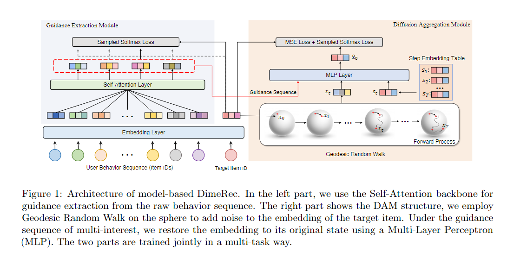

# [2024] DimeRec

> DimeRec: A Unified Framework for Enhanced Sequential Recommendation via Generative Diffusion Models（中科大）


DimeRec 协同结合了引导提取模块（GEM）和生成 扩散聚合模块（DAM）。 GEM 从用户的非平稳交互历史中提取关键的平稳指导信号，而 DAM 采用以 GEM 输出为条件的生成扩散过程来重建并生成一致的建议.

***近期 Diffusion 相关的序列推荐算法：***

- DiffRec(苏大) 合并了一个额外的转换，把item从离散空间映射到连续空间，噪声和去噪方法专门应用于target item

- DiffuRec在前向过程中利用 truncated scheduled Gaussian noise 来破坏target item embedding。此外还引入了 Transformer 的近似器结构在反向过程中预测 x0

- DreamRec 放弃了负采样，把推荐任务彻底变为**学习生成任务**，在特定数据集有效，但是在工业环境效果不佳

- DCDR 设计了一种新的离散条件扩散重排序框架，通过离散空间中的扩散过程逐步商城和优化推荐列表，但是，**仅适用于推荐重排序，不适用于检索阶段**

## Method



模型框架由两个相互依赖的模块组成：
1. 引导提取模块 ```GEM```
2. 扩散聚合模块 ```DAM```

In the first stage, GEM接受用户的原始行为序列Su，并提取出抽象的用户嵌入序列 gu

$$
G^u = GEM_{\phi}(S^u)
$$

现有的Diff推荐模型都是直接从整个用户的行为序列中提取和编码信息，然后将其作为扩散模块的去噪过程的指导。

但是由于用户兴趣以及行为历史是非平稳的，其模糊的信息可能会导致扩散模型的不稳定。

**GEM通过为特定任务设计的规则、强大的动态路由或自注意力来提取用户相对固定的兴趣**。


In the second stage，DAM充分利用扩散模型把上述用户嵌入序列gu聚合到latent embedding space，以生成最终的用户嵌入序列eu：

$$
e_u = DAM_{\theta}(g^u,x^t,t)
$$


