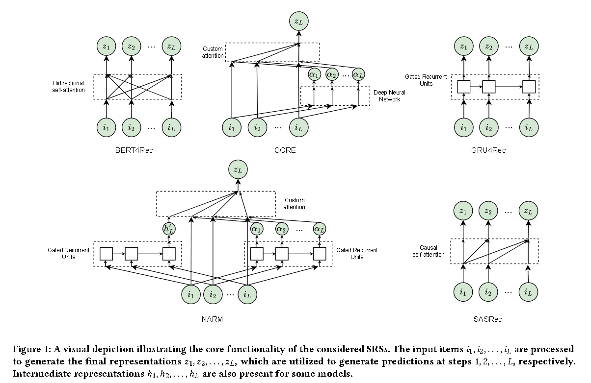
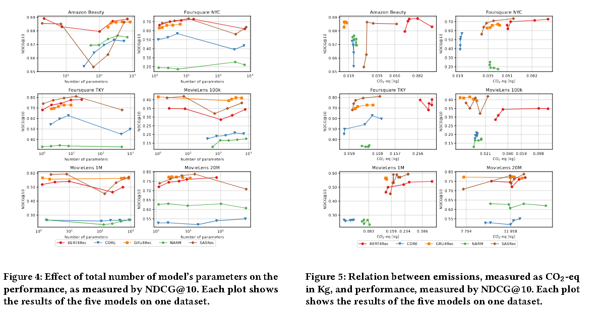

# EasyRec

> A Reproducible Analysis of Sequential Recommender Systems(罗马大学)

通过利用序列数据，SRS 可以识别用户行为的时间模式，从而显着提高推荐的准确性和相关性.

However, 现有的工作在结果的再现性和可复制性方面存在缺陷，导致论文之间的陈述不一致.

在 Abstract 中提出的第一个观点： 数据集较小的时候吗，SASRec 的性能并不总是优于 GRU4Rec。

代码： https://github.com/antoniopurificato/recsys_repro_conf

SAS过程：Markov Chain -> DNN -> Transformer（SASRec， BERT4Rec）, 这些模型的再现性仍然是一个悬而未决的问题。因此提出了模型EasyRec，**在简化数据预处理和简化模型实施**

## 贡献

1. 提供各种数据预处理方法
2. 多个模型上进行训练，减少性能比较中的偏差
3. 提出了一些新的见解，如：
   1. 和其他文章不同，GRU4Rec表现出了更强的性能，通常优于其他SRS
   2. 与基于gru的模型相比，基于transformer的模型在更高的嵌入维度上的性能提升更为明显
   3. **最优输入序列长度与每个数据集的平均用户序列长度有关，突出了数据集特定考虑因素的重要性**
   4. 基于transformer的模型随着嵌入维数的增加而呈指数级增长，**但性能改进没有类似的扩展**

Training中还是采用交叉熵损失训练SRS models，对于每个模型训练400个epoch。

> 所有实验均在具有 10752 个 CUDA 核心和 48 GB VRAM 的单个 NVIDIA RTX Aϳϭϭϭ 上进行

得到的结果其实就是：得到相同指标，在EasyRec上要比BoleRec花费更少的时间

## 结果

### 基本性能

GRU在 ML 的三个数据集上效果超过 SAS和其他数据集。而 NARM 和 CORE 的性能始终低于其他框架模型（这种差异可以归因于这些架构所采用的序列到项目的训练范式，这与其他模型所采用的序列到序列的训练不同）。

相反， NARM 和 CORE 能够在具有短输入序列的数据集上取得较高的结果，和彼此论文中一致：***强调了CORE有效捕捉短期用户偏好的能力***。

### 输入序列长度

可以通过访问更长的交互历史记录来捕获更丰富的用户偏好，这和SAS原始论文中的主张项目矛盾（即该模型不能有效地扩展到非常长的序列）

EasyRec结论： SASRec 可能受益于较长的序列

### Embedding大小

基于GRU的模型性能不受embedding size的影响，但是基于注意力的模型效果会随着embedding size大小而改变。

结论：随着嵌入大小的增加，基于 Transformer 的模型优于基于 GRU 的模型。（如果有足够的计算资源，基于 Transformer 的模型在较大的嵌入尺寸上具有引人注目的优势）

## 结论

本文的实验结果通过证明具有低维嵌入的 GRU4Rec 的有效性以及基于 Transformer 的具有大尺寸embedding size的model的优越性。

We also highlight the importance of managing input sequence length based on dataset statistics。

