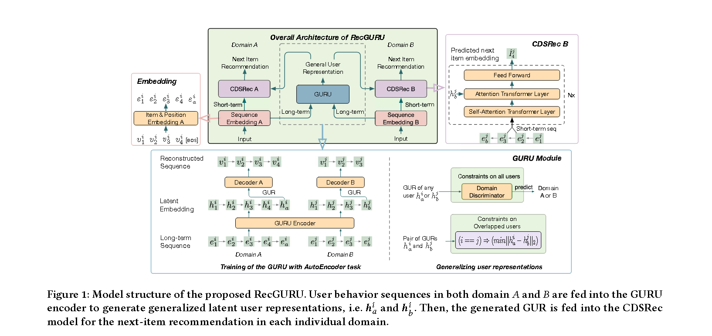
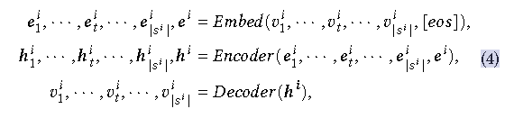
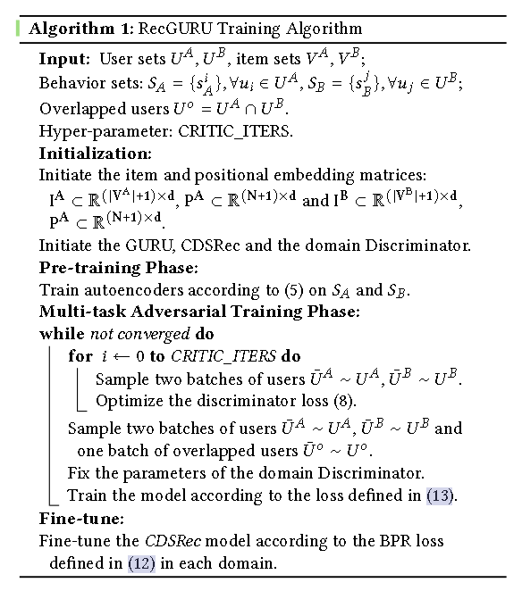

# [2022]RecGURU

> RecGURU: Adversarial Learning of Generalized User Representations for Cross-Domain Recommendation(University of Alberta, 腾讯)


Cross-domain recommendation can help alleviate the data sparsity issue in traditional sequential recommender systems.跨域推荐可以解决传统sequence推荐中数据稀疏的问题

RecGURU的核心思想是生成通用的用户表示（GUR），在sequence推荐中合并跨域的用户信息。

文章中提出了：
1. a self-attentive autoencoder to derive latent user representations（自注意力自编码器来encode user表征）
2. a domain discriminator, which aims to predict the origin domain of a generated latent representation（域鉴别器，用来预测生成潜在表征的原始域）
3. a novel adversarial learning method to train the two modules to unify user embeddings generated from different domains into a single global GUR for each user（对抗学习方法进行训练）

## 目的

2022年之前很多sequence推荐都集中在**单个领域**，因为 ***大多数用户可能在感兴趣 的领域中只有很短的行为历史*** ， 所以可能会产生稀疏问题。

跨域通过利用多个领域的用户行为来帮 助目标领域的推荐来解决数据稀疏问题。

transfer learning of user and item information from diverse perspectives

组成为两个部分：
 - the Generalized User Representation Unit (GURU) to obtain a single Generalized User Representation (GUR) for each user
 - Cross-Domain Sequential Recommendation (CDSRec) unit to achieve cross-domain collaboration in sequential recommendation task


## Method

$$
U = \{u_1, u_2, ..., u_{|U|}\}
$$

$$
V = \{v_1, v_2, ..., v_{|V|}\}
$$

上述式子中```|U|```和```|V|```分别标识users和items的总数，对于每一个user i，讲其与item的交互按照时间顺序排序，制作成序列：

$$
s^i = (v_1^i, ..., v_{|s^i|}^i)
$$

还是传统序列推荐的预测，通过n之前的序列行为，推测n+1时刻用户的交互。本文使用了跨领域结合的方法，整合不同领域中重叠用户的信息进行推荐，如果domains A和B中，如果用户行为重合（user在 domains A和B中都和对应的items有交互）,那么就结合两个域的信息进行推荐：

$$
p(v^i_{|s^i_A|+1} = v|s_A^i, s^i_B)
$$

如果两个域中用户没有重叠信息，那么就使用另一个域的隐式信息进行增强：

$$
p(v^i_{|s^i_A|+1} = v|s^i_A, info(S_B))
$$




在单域中的User标识, The autoencoder in our framework consists of an embedding module, an encoder module, and a decoder module.



其中h表示item v在 t位置的潜在表示，e是item embedding 和 position embedding的组合


自动编码器结构应用于序列样本，因此我们 将输入序列的重建损失公式如下：

$$
L_{rec}(s^i, \widehat{s}^i) = -\log{
    p(\widehat{s}^i | s^i)
}
= - \sum^N_{t=1}{
    \log{p(
        \widehat{v}^i_t | \widehat{v}^i_{<t}, h^i
    )}
}
$$


## Cross-domain Rec




对于指定domain A中的特定user ui，我们计算时间戳 t 的bpr损失：

$$

L_{bpr}^t = -\log{
    \sigma{(
        q^{i,t}_A I_v
    )} - \log{(
        1 - \sigma{
            {|N_s|}^{-1} \sum_{v^`}{
                q^{i,t}_A I_{v^`}
            }
        }
    )}
}
$$


## 补充

GURU consists of one shared encoder and two decoders which form two Autoencoder frameworks in both the target and source domains.

a domain discriminator is adopted to unify user representations from both domains in an adversarial learning scheme.

总的来说，GURU中的encoder就是堆叠了一些transformer layers，用于对用户信息进行提取。而Domain Discriminator是一个二分类器，用来判断送进去的user表征是来自域A还是域B。


CDSRec中 the input of the CDSRec is the short-time activity of a user which aims to model users' dynamic preference in the target domain.

The longterm interest and cross information are provided by the GURU。

最后通过注意力机制，将GURU生成的长期兴趣和CDSRec里的短期注意进行结合，从而在目标领域中进行序列推荐。


