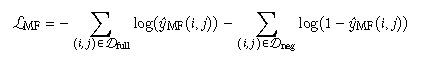

# CADC

> CADC: Encoding User-Item Interactions for Compressing Recommendation Model Training Data(University of Southern California)

如果能够捕获用户-项目交互历史记录来丰富用户和项目嵌入，那么就可以在不损失模型准确性的情况下压缩交互历史记录。

CADC采用两步方法来进行训练数据集压缩：
- 使用user-item interaction matrix的矩阵分解来创建user和item的embedding representation
- 对训练数据均匀随机采样，大幅度减少训练集大小,同时最大限度地减少模型精度下降

必须捕获用户-项目交互中存在的协作信息，以在减小数据集大小时确保模型的准确性.

CADC使用协作过滤模型，特别是 MF， 根据U和V的完整交互配置文件生成U和V的预训练embedding。

然后把这个嵌入集成到双塔模型中，结合这些预训练权重，封装来自数据集的整个协作信息，允许双塔模型获获取到全面的交互数据。

这种 战略集成极大地减轻了训练数据过滤的不利影响， 并通过维护协作信息来保持模型的准确性。

## Method

MF是为了把整个协作信息封装成为一组嵌入向量。

这个方法用于数据量极大（工业环境）中，由于训练集D规模巨大，需要一种高效的计算方法，而MF可以**把高维交互空间简化为低维连续特征空间**，从而有效的捕获user-item的动态交互信息。

在MF中，作者建立了两个独立的embedding： 一个用于user，一个用于item。

为了增强模型获取**个人偏好和物品质量的能力**，论文将每个模型的最后一个元素作为偏差项，最后user和item的交互公式为：

$$
\widehat{y}MF(i, j) = \sigma((u_i^`*v_j^`) + u_{i, bias} + v_{j, bias} + b)
$$

u,v`表示u，v的n-1项目（因为最后一项是偏置项）

之后采用二元交叉熵损失来优化嵌入。由于数据集的隐式反馈性质和正交互的稀缺，我们实施负采样来平衡标签的分布。

具体来说，生成了负样本集Dn来抵消数据的稀疏性，其中大多数标签是0，损失如下：

## TTNN

双塔模型，本文中通过不同的路径处理用户和item的特征，每个路径都包含一个MLP：user tower Tu和item tower Ti。

Tu处理对应的user标识符和其对应的特征的串联向量：

$$
F_{user, i} = [id_{user, i}; features_{user, i}]
$$

并且 Ti 处理和 Tu 相似：

$$
F_{item, j} = [id_{item, j}; features_{item,j}]
$$

用户和item之间的交互通过每个tower输出的嵌入embedding的dot进行建模，然后使用sigmoid来计算预测分数：

$$
\widehat{y}TTNN_{i,j} = \sigma(
    T_{user}(T_{user, i})^T * T_{item}(T_{item, j})
)
$$

## 结论

这项研究引入了 CADC，这是一种开创性的方法，旨在 在大规模数据集上有效地训练 DLRM，而不会显着影响 模型的准确性。