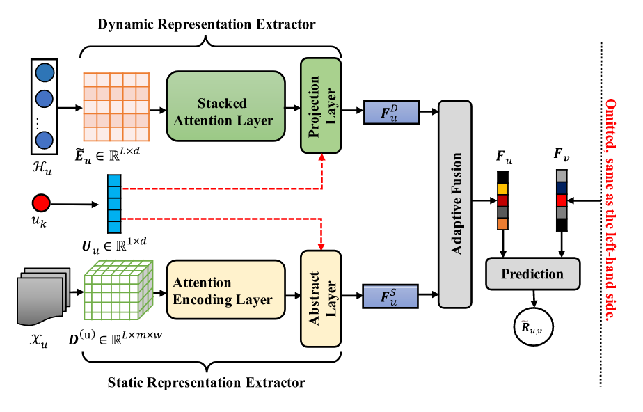

# [2024]DSRLN

> Dynamic and Static Representation Learning Network for Recommendation(浙江农林，北邮)

基于 ***评论*** 的推荐方法通过静态策略从 用户生成的评论中学习用户和项目的潜在表示，无法捕获用户兴趣的动态演变和项目的动态吸引力。

通过探索交互序列的 内部关系来建模用户兴趣的动态演化，并使用静态 表示提取器通过学习评论的语义连贯性和特征强度 信息来建模用户的内在偏好。

## A. ***Dynamic Representation Extractor***

传统动态兴趣采用LSTM，但是会出现长序列梯度消失问题，并且无法捕捉到item-item之间内部的关系。论文采用自注意机制来构造提取器，提出三个模块：嵌入层、堆叠注意力层、项目层。

